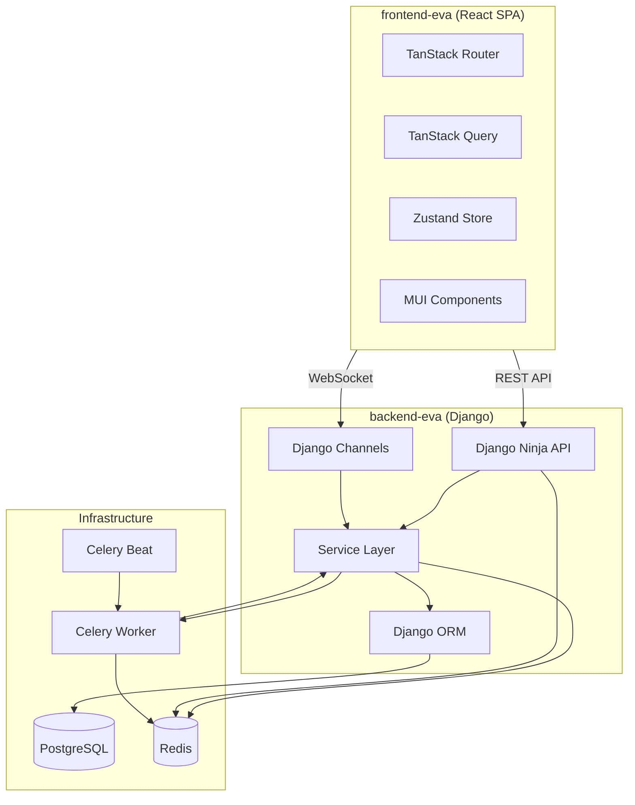
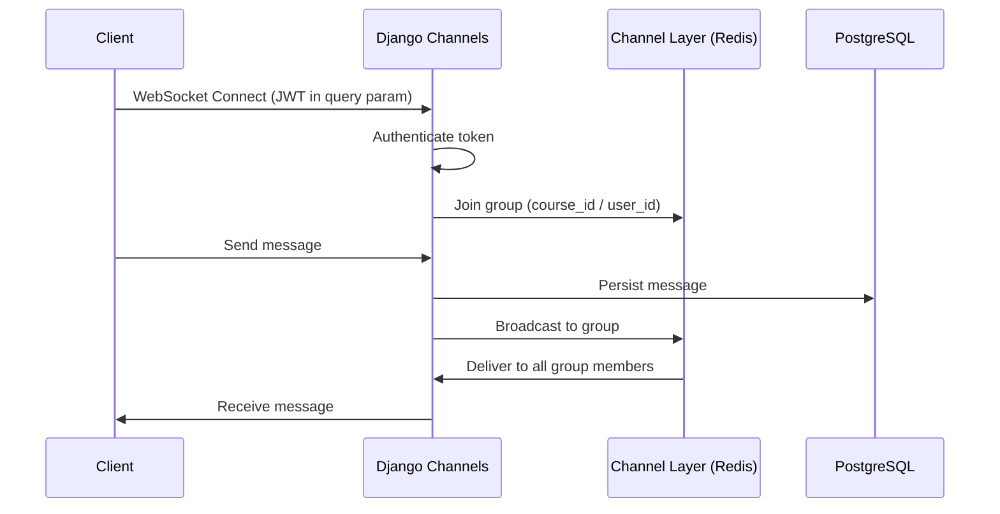
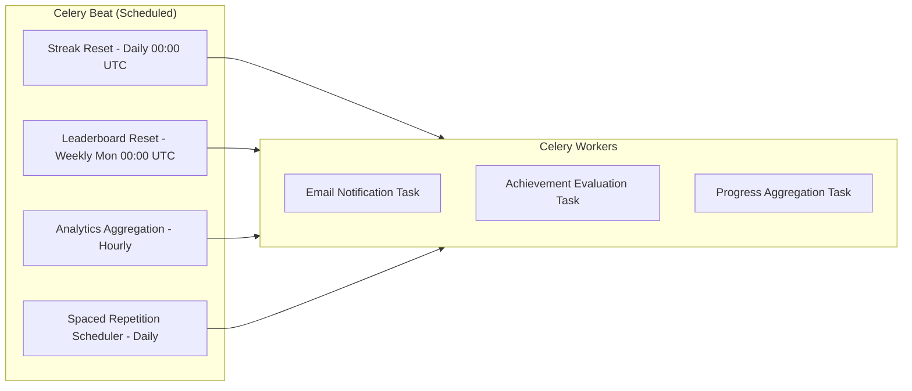
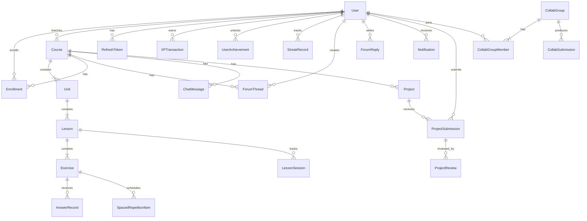

# Technical Design Document — EVA Learning Platform

## Overview

EVA (Entorno Virtual de Enseñanza-Aprendizaje) is a production-grade learning platform combining four pedagogical models into a single system: Conductismo (gamification), Cognitivismo (adaptive learning), Conectivismo (social features), and Constructivismo (collaborative projects). The platform is a two-tier web application with a Django backend exposing a REST + WebSocket API and a React SPA frontend.

The backend follows a modular Django apps architecture with a service layer pattern. Each domain (accounts, courses, exercises, gamification, progress, social, projects, collaboration, notifications) is an isolated Django app with its own models, services, schemas, and API routes. Cross-domain communication happens through service-layer imports, never direct model access across apps.

The frontend is a feature-based React application using TanStack Router (file-based routing), TanStack Query (server state), Zustand (client state), MUI (component library), and CSS modules (styling). It communicates with the backend via REST for CRUD operations and WebSocket for real-time features (chat, notifications, collaborative workspaces).

### Key Architectural Decisions

- **Django Ninja** over DRF: Pydantic-native schemas, async support, OpenAPI generation, and better type safety with MyPy.
- **Service layer pattern**: API routes delegate to service functions. Models are never accessed directly from views. This enables testability and separation of concerns.
- **Token rotation with family tracking**: Refresh tokens use a family ID to detect replay attacks. Reuse of a rotated-out token invalidates the entire family.
- **Redis for caching + pub/sub**: Leaderboards use Redis sorted sets. Channel Layer uses Redis for WebSocket message routing. Rate limiting uses Redis counters.
- **Celery for async work**: Email notifications, streak resets, leaderboard resets, analytics aggregation, and spaced repetition scheduling all run as Celery tasks.
- **Pydantic everywhere**: Request/response schemas (Django Ninja), settings (pydantic-settings), and internal DTOs all use Pydantic for validation and type safety.



## Architecture

### Backend Architecture

The backend is organized as a Django project (`backend-eva`) with the following app structure:

```
backend-eva/
├── config/                  # Django project settings
│   ├── settings.py          # pydantic-settings based config
│   ├── urls.py              # Root URL config mounting Django Ninja
│   ├── asgi.py              # ASGI app with Channels routing
│   ├── wsgi.py
│   └── celery.py            # Celery app configuration
├── apps/
│   ├── accounts/            # Auth, users, roles, tokens
│   ├── courses/             # Course → Unit → Lesson hierarchy, enrollment
│   ├── exercises/           # Exercise types, validation, lesson player
│   ├── gamification/        # XP, levels, streaks, achievements, leaderboards
│   ├── progress/            # Student progress tracking, analytics
│   ├── social/              # Forums, real-time chat
│   ├── projects/            # Real-world projects, rubrics, peer review
│   ├── collaboration/       # Group exercises, shared workspaces
│   └── notifications/       # In-app + email notifications
├── common/                  # Shared utilities, base models, permissions
│   ├── models.py            # TimestampedModel base
│   ├── permissions.py       # Role-based permission classes
│   ├── pagination.py        # Cursor/offset pagination
│   ├── sanitization.py      # XSS sanitization utilities
│   └── rate_limiting.py     # Redis-based rate limiter
└── manage.py
```

Each app follows this internal structure:

```
apps/{app_name}/
├── models.py          # Django models
├── services.py        # Business logic (service layer)
├── schemas.py         # Pydantic schemas (request/response DTOs)
├── api.py             # Django Ninja router endpoints
├── tasks.py           # Celery tasks (if applicable)
├── consumers.py       # Django Channels consumers (if applicable)
├── admin.py           # Django admin registration
└── tests/
    ├── test_services.py
    ├── test_api.py
    └── test_properties.py  # Property-based tests
```

### Service Layer Pattern

All business logic lives in `services.py`. API routes and Channels consumers are thin wrappers that validate input, call service functions, and return responses.

```python
# Example: apps/courses/api.py
@router.post("/courses", response=CourseOut)
def create_course(request, payload: CourseCreateIn) -> CourseOut:
    course = CourseService.create_course(
        teacher=request.auth, data=payload
    )
    return CourseOut.from_orm(course)

# Example: apps/courses/services.py
class CourseService:
    @staticmethod
    def create_course(teacher: User, data: CourseCreateIn) -> Course:
        # Business logic, validation, model creation
        ...
```

### Frontend Architecture

```
frontend-eva/
├── src/
│   ├── app/                    # App shell, providers, theme
│   │   ├── App.tsx
│   │   ├── providers.tsx       # QueryClient, Router, Theme providers
│   │   └── theme.ts            # MUI custom theme
│   ├── routes/                 # TanStack Router file-based routes
│   │   ├── __root.tsx          # Root layout with Suspense
│   │   ├── index.tsx           # Landing page
│   │   ├── login.tsx
│   │   ├── register.tsx
│   │   ├── dashboard/
│   │   │   └── index.tsx       # Student dashboard
│   │   ├── courses/
│   │   │   ├── index.tsx       # Course listing
│   │   │   ├── $courseId.tsx    # Course detail
│   │   │   └── $courseId/
│   │   │       ├── lessons/
│   │   │       │   └── $lessonId.tsx  # Lesson player
│   │   │       ├── forum.tsx
│   │   │       └── chat.tsx
│   │   ├── teacher/
│   │   │   ├── index.tsx       # Teacher dashboard
│   │   │   ├── courses/
│   │   │   │   └── $courseId/
│   │   │   │       └── builder.tsx  # Course builder
│   │   │   └── analytics/
│   │   │       └── $courseId.tsx
│   │   ├── projects/
│   │   │   ├── index.tsx
│   │   │   └── $projectId.tsx
│   │   └── profile/
│   │       └── index.tsx       # Profile + achievements
│   ├── features/               # Feature modules
│   │   ├── auth/
│   │   │   ├── api.ts          # Auth API calls
│   │   │   ├── store.ts        # Zustand auth store
│   │   │   ├── hooks.ts        # useAuth, useUser hooks
│   │   │   └── components/
│   │   ├── courses/
│   │   │   ├── api.ts
│   │   │   ├── hooks.ts
│   │   │   ├── types.ts
│   │   │   └── components/
│   │   ├── exercises/
│   │   ├── gamification/
│   │   ├── social/
│   │   ├── projects/
│   │   ├── collaboration/
│   │   ├── notifications/
│   │   └── progress/
│   ├── shared/                 # Shared UI components
│   │   ├── components/         # Dumb/presentational components
│   │   ├── hooks/              # Shared hooks
│   │   ├── utils/              # Utility functions
│   │   └── types/              # Shared TypeScript types
│   └── lib/
│       ├── api-client.ts       # Axios instance with interceptors
│       └── websocket.ts        # WebSocket connection manager
├── index.html
├── vite.config.ts
├── tsconfig.json
└── package.json
```

### API Client with Token Refresh

The frontend API client uses Axios interceptors to handle automatic token refresh:

```typescript
// lib/api-client.ts
const apiClient = axios.create({ baseURL: '/api/v1', withCredentials: true });

apiClient.interceptors.response.use(
  (response) => response,
  async (error) => {
    if (error.response?.status === 401 && !error.config._retry) {
      error.config._retry = true;
      const { accessToken } = await refreshToken(); // POST /auth/refresh (cookie)
      useAuthStore.getState().setAccessToken(accessToken);
      error.config.headers.Authorization = `Bearer ${accessToken}`;
      return apiClient(error.config);
    }
    return Promise.reject(error);
  }
);
```

### WebSocket Architecture

Django Channels handles two WebSocket use cases:

1. **Course Chat** (`ws://host/ws/chat/{course_id}/`): Real-time messaging per course room.
2. **Notifications** (`ws://host/ws/notifications/`): Per-user notification delivery.
3. **Collaboration** (`ws://host/ws/collab/{exercise_id}/{group_id}/`): Shared workspace updates.



### Celery Task Architecture



## Components and Interfaces

### Backend API Routes (Django Ninja)

All API routes are versioned under `/api/v1/`. Each app registers a router.

#### accounts (Auth)
| Method | Endpoint | Auth | Description |
|--------|----------|------|-------------|
| POST | `/auth/register` | None | Register new user |
| POST | `/auth/login` | None | Login, returns access + refresh tokens |
| POST | `/auth/logout` | Bearer | Logout, invalidate refresh token |
| POST | `/auth/refresh` | Cookie | Rotate tokens |
| GET | `/auth/me` | Bearer | Get current user profile |
| PATCH | `/users/{id}/role` | Admin | Change user role |

#### courses
| Method | Endpoint | Auth | Description |
|--------|----------|------|-------------|
| GET | `/courses` | Bearer | List published courses (Student) or owned courses (Teacher) |
| POST | `/courses` | Teacher | Create course |
| GET | `/courses/{id}` | Bearer | Course detail with units/lessons |
| PATCH | `/courses/{id}` | Teacher+Owner | Update course |
| POST | `/courses/{id}/publish` | Teacher+Owner | Publish course |
| POST | `/courses/{id}/units` | Teacher+Owner | Add unit |
| PATCH | `/units/{id}` | Teacher+Owner | Update unit |
| POST | `/units/{id}/lessons` | Teacher+Owner | Add lesson |
| PATCH | `/lessons/{id}` | Teacher+Owner | Update lesson |
| POST | `/courses/{id}/enroll` | Student | Enroll in course |
| DELETE | `/courses/{id}/enroll` | Student | Unenroll from course |
| GET | `/enrollments` | Student | List enrolled courses with progress |

#### exercises
| Method | Endpoint | Auth | Description |
|--------|----------|------|-------------|
| POST | `/lessons/{id}/exercises` | Teacher+Owner | Create exercise |
| PATCH | `/exercises/{id}` | Teacher+Owner | Update exercise |
| DELETE | `/exercises/{id}` | Teacher+Owner | Delete exercise |
| GET | `/lessons/{id}/start` | Student+Enrolled | Start lesson player session |
| POST | `/exercises/{id}/submit` | Student+Enrolled | Submit answer |
| GET | `/lessons/{id}/resume` | Student+Enrolled | Resume lesson from saved progress |

#### gamification
| Method | Endpoint | Auth | Description |
|--------|----------|------|-------------|
| GET | `/gamification/profile` | Bearer | XP, level, streak, achievements |
| GET | `/gamification/leaderboard` | Bearer | Leaderboard (query: period=weekly\|alltime) |
| GET | `/gamification/achievements` | Bearer | All achievements with unlock status |
| GET | `/gamification/xp-history` | Bearer | XP transaction log |

#### progress
| Method | Endpoint | Auth | Description |
|--------|----------|------|-------------|
| GET | `/progress/dashboard` | Student | Overall progress stats |
| GET | `/progress/courses/{id}` | Student+Enrolled | Per-course progress detail |
| GET | `/progress/activity` | Student | Activity heatmap data (90 days) |
| GET | `/progress/mastery` | Student | Topic mastery scores |

#### social
| Method | Endpoint | Auth | Description |
|--------|----------|------|-------------|
| GET | `/courses/{id}/forum/threads` | Bearer+Enrolled | List forum threads (paginated) |
| POST | `/courses/{id}/forum/threads` | Bearer+Enrolled | Create thread |
| GET | `/forum/threads/{id}` | Bearer+Enrolled | Thread detail with replies |
| POST | `/forum/threads/{id}/replies` | Bearer+Enrolled | Reply to thread |
| POST | `/forum/posts/{id}/flag` | Teacher\|Admin | Flag post |
| POST | `/forum/replies/{id}/upvote` | Bearer+Enrolled | Toggle upvote |

#### projects
| Method | Endpoint | Auth | Description |
|--------|----------|------|-------------|
| POST | `/projects` | Teacher | Create project |
| GET | `/projects/{id}` | Bearer+Enrolled | Project detail |
| POST | `/projects/{id}/submit` | Student+Enrolled | Submit project (multipart) |
| POST | `/submissions/{id}/review` | Teacher | Teacher review with rubric scores |
| POST | `/submissions/{id}/peer-review` | Student | Peer review |
| GET | `/submissions/{id}/reviews` | Bearer | Get reviews for submission |

#### collaboration
| Method | Endpoint | Auth | Description |
|--------|----------|------|-------------|
| POST | `/exercises/{id}/collab/join` | Student+Enrolled | Join collaborative exercise |
| POST | `/collab/groups/{id}/submit` | Student+GroupMember | Submit group work |
| GET | `/collab/groups/{id}` | Student+GroupMember | Get group info and workspace state |

#### notifications
| Method | Endpoint | Auth | Description |
|--------|----------|------|-------------|
| GET | `/notifications` | Bearer | List notifications (paginated) |
| GET | `/notifications/unread-count` | Bearer | Unread notification count |
| POST | `/notifications/{id}/read` | Bearer | Mark notification as read |
| POST | `/notifications/read-all` | Bearer | Mark all as read |

#### teacher analytics
| Method | Endpoint | Auth | Description |
|--------|----------|------|-------------|
| GET | `/teacher/courses/{id}/analytics` | Teacher+Owner | Course aggregate stats |
| GET | `/teacher/courses/{id}/students` | Teacher+Owner | Student list with progress |
| GET | `/teacher/courses/{id}/students/{sid}` | Teacher+Owner | Detailed student progress |
| GET | `/teacher/courses/{id}/heatmap` | Teacher+Owner | Exercise accuracy heatmap |

### WebSocket Endpoints (Django Channels)

| Endpoint | Auth | Description |
|----------|------|-------------|
| `ws/chat/{course_id}/` | JWT query param | Course chat room |
| `ws/notifications/` | JWT query param | User notification stream |
| `ws/collab/{exercise_id}/{group_id}/` | JWT query param | Collaborative workspace |

### Key Service Interfaces

```python
# accounts/services.py
class AuthService:
    def register(data: RegisterIn) -> User
    def login(data: LoginIn) -> TokenPair
    def logout(user: User, refresh_token: str) -> None
    def refresh_tokens(refresh_token: str) -> TokenPair
    def change_role(admin: User, target_user_id: int, new_role: Role) -> User

# courses/services.py
class CourseService:
    def create_course(teacher: User, data: CourseCreateIn) -> Course
    def publish_course(teacher: User, course_id: int) -> Course
    def reorder_units(teacher: User, course_id: int, order: list[int]) -> None
    def enroll(student: User, course_id: int) -> Enrollment
    def unenroll(student: User, course_id: int) -> None

# exercises/services.py
class ExerciseService:
    def create_exercise(teacher: User, lesson_id: int, data: ExerciseCreateIn) -> Exercise
    def start_lesson(student: User, lesson_id: int) -> LessonSession
    def submit_answer(student: User, exercise_id: int, answer: AnswerIn) -> AnswerResult
    def resume_lesson(student: User, lesson_id: int) -> LessonSession

# gamification/services.py
class GamificationService:
    def award_xp(student: User, source_type: str, source_id: int, amount: int) -> XPTransaction
    def check_level_up(student: User) -> LevelUpResult | None
    def evaluate_achievements(student: User) -> list[Achievement]
    def get_leaderboard(period: str, user: User) -> LeaderboardResult
    def update_streak(student: User) -> StreakResult
    def reset_expired_streaks() -> int  # Celery task entry point

# progress/services.py
class ProgressService:
    def initialize_course_progress(student: User, course_id: int) -> None
    def update_lesson_progress(student: User, lesson_id: int, score: float) -> None
    def get_dashboard(student: User) -> DashboardData
    def get_course_progress(student: User, course_id: int) -> CourseProgressData
    def get_activity_heatmap(student: User, days: int = 90) -> list[ActivityDay]

# adaptive/services.py (within exercises app)
class AdaptiveService:
    def record_answer(student: User, exercise: Exercise, correct: bool) -> None
    def get_mastery_scores(student: User, course_id: int) -> dict[int, float]
    def should_recommend_review(student: User, unit_id: int) -> ReviewRecommendation | None
    def generate_review_session(student: User, course_id: int) -> list[Exercise]
    def schedule_spaced_repetition(student: User, exercise: Exercise) -> None
```


## Data Models

All models inherit from `TimestampedModel` which provides `created_at` and `updated_at` fields with auto-set timestamps.



### accounts app

```python
class Role(models.TextChoices):
    STUDENT = "student"
    TEACHER = "teacher"
    ADMIN = "admin"

class User(AbstractUser):
    """Extended user model with role and profile fields."""
    email = models.EmailField(unique=True)  # Used as login identifier
    display_name = models.CharField(max_length=100)
    role = models.CharField(max_length=10, choices=Role.choices, default=Role.STUDENT)
    timezone = models.CharField(max_length=50, default="UTC")
    # Auth via email, not username
    USERNAME_FIELD = "email"
    REQUIRED_FIELDS = ["display_name"]

class RefreshToken(TimestampedModel):
    """Tracks refresh tokens for rotation and replay detection."""
    user = models.ForeignKey(User, on_delete=models.CASCADE, related_name="refresh_tokens")
    token_hash = models.CharField(max_length=64, unique=True, db_index=True)  # SHA-256 hash
    family_id = models.UUIDField(db_index=True)  # Token family for replay detection
    is_revoked = models.BooleanField(default=False)
    expires_at = models.DateTimeField()

    class Meta:
        indexes = [
            models.Index(fields=["family_id", "is_revoked"]),
        ]
```

### courses app

```python
class Course(TimestampedModel):
    """Top-level content container."""
    class Status(models.TextChoices):
        DRAFT = "draft"
        PUBLISHED = "published"

    title = models.CharField(max_length=200)
    description = models.TextField()
    teacher = models.ForeignKey(User, on_delete=models.CASCADE, related_name="taught_courses")
    status = models.CharField(max_length=10, choices=Status.choices, default=Status.DRAFT)
    published_at = models.DateTimeField(null=True, blank=True)

class Unit(TimestampedModel):
    """Second level in Course → Unit → Lesson → Exercise hierarchy."""
    course = models.ForeignKey(Course, on_delete=models.CASCADE, related_name="units")
    title = models.CharField(max_length=200)
    order = models.PositiveIntegerField()

    class Meta:
        ordering = ["order"]
        unique_together = [("course", "order")]

class Lesson(TimestampedModel):
    """Third level. Contains exercises."""
    unit = models.ForeignKey(Unit, on_delete=models.CASCADE, related_name="lessons")
    title = models.CharField(max_length=200)
    order = models.PositiveIntegerField()

    class Meta:
        ordering = ["order"]
        unique_together = [("unit", "order")]

class Enrollment(TimestampedModel):
    """Links a Student to a Course."""
    student = models.ForeignKey(User, on_delete=models.CASCADE, related_name="enrollments")
    course = models.ForeignKey(Course, on_delete=models.CASCADE, related_name="enrollments")
    is_active = models.BooleanField(default=True)
    enrolled_at = models.DateTimeField(auto_now_add=True)

    class Meta:
        unique_together = [("student", "course")]
```

### exercises app

```python
class ExerciseType(models.TextChoices):
    MULTIPLE_CHOICE = "multiple_choice"
    FILL_BLANK = "fill_blank"
    MATCHING = "matching"
    FREE_TEXT = "free_text"

class Exercise(TimestampedModel):
    """An exercise within a lesson. Type-specific data stored in JSON fields."""
    lesson = models.ForeignKey(Lesson, on_delete=models.CASCADE, related_name="exercises")
    exercise_type = models.CharField(max_length=20, choices=ExerciseType.choices)
    question_text = models.TextField()
    order = models.PositiveIntegerField()
    # Type-specific configuration stored as JSON (validated by Pydantic schemas)
    config = models.JSONField()
    # e.g. multiple_choice: {"options": [...], "correct_index": 0}
    # e.g. fill_blank: {"blank_position": 3, "accepted_answers": ["answer1", "answer2"]}
    # e.g. matching: {"pairs": [{"left": "A", "right": "1"}, ...]}
    # e.g. free_text: {"model_answer": "...", "rubric": "..."}
    difficulty = models.PositiveSmallIntegerField(default=1)  # 1-5 scale
    topic = models.CharField(max_length=100, blank=True)  # For adaptive learning tagging
    is_collaborative = models.BooleanField(default=False)
    collab_group_size = models.PositiveSmallIntegerField(null=True, blank=True)  # 2-5

    class Meta:
        ordering = ["order"]
        unique_together = [("lesson", "order")]

class LessonSession(TimestampedModel):
    """Tracks a student's progress through a lesson player session."""
    student = models.ForeignKey(User, on_delete=models.CASCADE, related_name="lesson_sessions")
    lesson = models.ForeignKey(Lesson, on_delete=models.CASCADE, related_name="sessions")
    current_exercise_index = models.PositiveIntegerField(default=0)
    retry_queue = models.JSONField(default=list)  # Exercise IDs queued for retry
    is_completed = models.BooleanField(default=False)
    completed_at = models.DateTimeField(null=True, blank=True)
    correct_first_attempt = models.PositiveIntegerField(default=0)
    total_exercises = models.PositiveIntegerField(default=0)

    class Meta:
        unique_together = [("student", "lesson")]

class AnswerRecord(TimestampedModel):
    """Records each answer submission for analytics and adaptive learning."""
    student = models.ForeignKey(User, on_delete=models.CASCADE, related_name="answers")
    exercise = models.ForeignKey(Exercise, on_delete=models.CASCADE, related_name="answers")
    session = models.ForeignKey(LessonSession, on_delete=models.CASCADE, related_name="answers")
    submitted_answer = models.JSONField()  # Type-dependent answer data
    is_correct = models.BooleanField()
    is_first_attempt = models.BooleanField()
    answered_at = models.DateTimeField(auto_now_add=True)
```

### gamification app

```python
class GamificationProfile(TimestampedModel):
    """Aggregate gamification state for a student."""
    student = models.OneToOneField(User, on_delete=models.CASCADE, related_name="gamification_profile")
    total_xp = models.PositiveIntegerField(default=0)
    current_level = models.PositiveIntegerField(default=1)
    current_streak = models.PositiveIntegerField(default=0)
    longest_streak = models.PositiveIntegerField(default=0)
    last_activity_date = models.DateField(null=True, blank=True)

class XPTransaction(TimestampedModel):
    """Immutable log of every XP award."""
    student = models.ForeignKey(User, on_delete=models.CASCADE, related_name="xp_transactions")
    amount = models.PositiveIntegerField()
    source_type = models.CharField(max_length=50)  # "lesson", "achievement", "streak_bonus", "collab"
    source_id = models.PositiveIntegerField()  # ID of the source object
    timestamp = models.DateTimeField(auto_now_add=True)

class Achievement(TimestampedModel):
    """Achievement definition (system-wide)."""
    name = models.CharField(max_length=100, unique=True)
    description = models.TextField()
    icon = models.CharField(max_length=100)  # Icon identifier
    condition_type = models.CharField(max_length=50)  # "xp_total", "streak", "lessons_completed", etc.
    condition_value = models.PositiveIntegerField()  # Threshold value

class UserAchievement(TimestampedModel):
    """Tracks which achievements a student has unlocked."""
    student = models.ForeignKey(User, on_delete=models.CASCADE, related_name="achievements")
    achievement = models.ForeignKey(Achievement, on_delete=models.CASCADE, related_name="user_achievements")
    unlocked_at = models.DateTimeField(auto_now_add=True)

    class Meta:
        unique_together = [("student", "achievement")]
```

### progress app

```python
class CourseProgress(TimestampedModel):
    """Tracks a student's progress through a course."""
    student = models.ForeignKey(User, on_delete=models.CASCADE, related_name="course_progress")
    course = models.ForeignKey(Course, on_delete=models.CASCADE, related_name="student_progress")
    completion_percentage = models.FloatField(default=0.0)
    total_score = models.FloatField(default=0.0)
    lessons_completed = models.PositiveIntegerField(default=0)
    total_lessons = models.PositiveIntegerField(default=0)

    class Meta:
        unique_together = [("student", "course")]

class LessonProgress(TimestampedModel):
    """Tracks completion and score per lesson."""
    student = models.ForeignKey(User, on_delete=models.CASCADE, related_name="lesson_progress")
    lesson = models.ForeignKey(Lesson, on_delete=models.CASCADE, related_name="student_progress")
    is_completed = models.BooleanField(default=False)
    score = models.FloatField(default=0.0)  # Percentage correct
    completed_at = models.DateTimeField(null=True, blank=True)

    class Meta:
        unique_together = [("student", "lesson")]

class TopicMastery(TimestampedModel):
    """Adaptive learning: mastery score per topic per student."""
    student = models.ForeignKey(User, on_delete=models.CASCADE, related_name="topic_mastery")
    topic = models.CharField(max_length=100)
    course = models.ForeignKey(Course, on_delete=models.CASCADE, related_name="topic_mastery")
    correct_count = models.PositiveIntegerField(default=0)
    total_count = models.PositiveIntegerField(default=0)
    mastery_score = models.FloatField(default=0.0)  # Weighted by recency
    last_reviewed = models.DateTimeField(null=True, blank=True)

    class Meta:
        unique_together = [("student", "topic", "course")]

class SpacedRepetitionItem(TimestampedModel):
    """Schedules review exercises using spaced repetition intervals."""
    student = models.ForeignKey(User, on_delete=models.CASCADE, related_name="spaced_items")
    exercise = models.ForeignKey(Exercise, on_delete=models.CASCADE, related_name="spaced_items")
    next_review_date = models.DateField()
    interval_days = models.PositiveIntegerField(default=1)  # Current interval: 1, 3, 7, 14, 30
    review_count = models.PositiveIntegerField(default=0)

class DailyActivity(TimestampedModel):
    """Tracks daily learning activity for heatmap display."""
    student = models.ForeignKey(User, on_delete=models.CASCADE, related_name="daily_activities")
    date = models.DateField()
    lessons_completed = models.PositiveIntegerField(default=0)
    xp_earned = models.PositiveIntegerField(default=0)
    time_spent_minutes = models.PositiveIntegerField(default=0)

    class Meta:
        unique_together = [("student", "date")]
```

### social app

```python
class ForumThread(TimestampedModel):
    """A discussion thread in a course forum."""
    course = models.ForeignKey(Course, on_delete=models.CASCADE, related_name="forum_threads")
    author = models.ForeignKey(User, on_delete=models.CASCADE, related_name="forum_threads")
    title = models.CharField(max_length=200)
    body = models.TextField()
    is_hidden = models.BooleanField(default=False)
    last_activity_at = models.DateTimeField(auto_now_add=True)

    class Meta:
        ordering = ["-last_activity_at"]

class ForumReply(TimestampedModel):
    """A reply within a forum thread."""
    thread = models.ForeignKey(ForumThread, on_delete=models.CASCADE, related_name="replies")
    author = models.ForeignKey(User, on_delete=models.CASCADE, related_name="forum_replies")
    body = models.TextField()
    is_hidden = models.BooleanField(default=False)
    upvote_count = models.PositiveIntegerField(default=0)

class ReplyUpvote(TimestampedModel):
    """Tracks upvotes to prevent duplicates."""
    reply = models.ForeignKey(ForumReply, on_delete=models.CASCADE, related_name="upvotes")
    user = models.ForeignKey(User, on_delete=models.CASCADE, related_name="reply_upvotes")

    class Meta:
        unique_together = [("reply", "user")]

class ChatMessage(TimestampedModel):
    """Persisted chat message for a course chat room."""
    course = models.ForeignKey(Course, on_delete=models.CASCADE, related_name="chat_messages")
    author = models.ForeignKey(User, on_delete=models.CASCADE, related_name="chat_messages")
    content = models.TextField(max_length=2000)
    sent_at = models.DateTimeField(auto_now_add=True)

    class Meta:
        ordering = ["sent_at"]
```

### projects app

```python
class Project(TimestampedModel):
    """A real-world project assignment."""
    course = models.ForeignKey(Course, on_delete=models.CASCADE, related_name="projects")
    teacher = models.ForeignKey(User, on_delete=models.CASCADE, related_name="created_projects")
    title = models.CharField(max_length=200)
    description = models.TextField()
    rubric = models.JSONField()  # [{"criterion": "...", "max_score": 10, "description": "..."}, ...]
    submission_deadline = models.DateTimeField()
    peer_review_enabled = models.BooleanField(default=False)
    peer_reviewers_count = models.PositiveSmallIntegerField(default=2)

class ProjectSubmission(TimestampedModel):
    """A student's project submission."""
    project = models.ForeignKey(Project, on_delete=models.CASCADE, related_name="submissions")
    student = models.ForeignKey(User, on_delete=models.CASCADE, related_name="project_submissions")
    description = models.TextField()
    is_late = models.BooleanField(default=False)
    submitted_at = models.DateTimeField(auto_now_add=True)

    class Meta:
        unique_together = [("project", "student")]

class SubmissionFile(TimestampedModel):
    """File attached to a project submission. Max 5 files, 10MB each."""
    submission = models.ForeignKey(ProjectSubmission, on_delete=models.CASCADE, related_name="files")
    file = models.FileField(upload_to="project_submissions/%Y/%m/")
    filename = models.CharField(max_length=255)
    file_size = models.PositiveIntegerField()  # bytes

class ProjectReview(TimestampedModel):
    """Review of a project submission (teacher or peer)."""
    submission = models.ForeignKey(ProjectSubmission, on_delete=models.CASCADE, related_name="reviews")
    reviewer = models.ForeignKey(User, on_delete=models.CASCADE, related_name="project_reviews")
    review_type = models.CharField(max_length=10, choices=[("teacher", "Teacher"), ("peer", "Peer")])
    scores = models.JSONField()  # [{"criterion": "...", "score": 8}, ...]
    feedback = models.TextField()
    is_complete = models.BooleanField(default=False)

class PeerReviewAssignment(TimestampedModel):
    """Tracks peer review assignments."""
    submission = models.ForeignKey(ProjectSubmission, on_delete=models.CASCADE, related_name="peer_assignments")
    reviewer = models.ForeignKey(User, on_delete=models.CASCADE, related_name="peer_review_assignments")
    is_completed = models.BooleanField(default=False)

    class Meta:
        unique_together = [("submission", "reviewer")]
```

### collaboration app

```python
class CollabGroup(TimestampedModel):
    """A group formed for a collaborative exercise."""
    exercise = models.ForeignKey(Exercise, on_delete=models.CASCADE, related_name="collab_groups")
    max_size = models.PositiveSmallIntegerField()
    workspace_state = models.JSONField(default=dict)  # Shared workspace data
    is_submitted = models.BooleanField(default=False)

class CollabGroupMember(TimestampedModel):
    """Membership in a collaborative group."""
    group = models.ForeignKey(CollabGroup, on_delete=models.CASCADE, related_name="members")
    student = models.ForeignKey(User, on_delete=models.CASCADE, related_name="collab_memberships")
    joined_at = models.DateTimeField(auto_now_add=True)
    last_contribution_at = models.DateTimeField(null=True, blank=True)

    class Meta:
        unique_together = [("group", "student")]

class CollabSubmission(TimestampedModel):
    """Submission from a collaborative group."""
    group = models.ForeignKey(CollabGroup, on_delete=models.CASCADE, related_name="submissions")
    submitted_answer = models.JSONField()
    submitted_at = models.DateTimeField(auto_now_add=True)
```

### notifications app

```python
class Notification(TimestampedModel):
    """A notification record for a user."""
    class Channel(models.TextChoices):
        IN_APP = "in_app"
        EMAIL = "email"
        BOTH = "both"

    recipient = models.ForeignKey(User, on_delete=models.CASCADE, related_name="notifications")
    notification_type = models.CharField(max_length=50)  # "achievement", "forum_reply", "review", etc.
    title = models.CharField(max_length=200)
    body = models.TextField()
    data = models.JSONField(default=dict)  # Additional context (links, IDs)
    channel = models.CharField(max_length=10, choices=Channel.choices, default=Channel.IN_APP)
    is_read = models.BooleanField(default=False)
    email_sent = models.BooleanField(default=False)
```

### Redis Data Structures

Beyond caching and Channel Layer, Redis is used for:

| Key Pattern | Type | Purpose |
|-------------|------|---------|
| `leaderboard:weekly` | Sorted Set | Weekly XP leaderboard (member=user_id, score=xp) |
| `leaderboard:alltime` | Sorted Set | All-time XP leaderboard |
| `rate_limit:{endpoint}:{ip}` | String (counter) | Rate limiting with TTL |
| `lesson_session:{user_id}:{lesson_id}` | Hash | Active lesson session cache |
| `user:{user_id}:unread_count` | String (counter) | Notification unread count cache |


## Correctness Properties

*A property is a characteristic or behavior that should hold true across all valid executions of a system — essentially, a formal statement about what the system should do. Properties serve as the bridge between human-readable specifications and machine-verifiable correctness guarantees.*

### Property 1: Registration creates a valid account

*For any* valid registration input (valid email format, password with ≥8 chars including uppercase, lowercase, and numeric), the Auth_Service should create a new user with the Student role, and the stored password should never equal the plaintext password (it must be hashed).

**Validates: Requirements 1.1, 1.3**

### Property 2: Registration rejects invalid input

*For any* registration input where the email is already in use, the email format is invalid, or the password fails strength requirements (too short, missing character classes), the Auth_Service should reject the registration and the total user count should remain unchanged.

**Validates: Requirements 1.2, 1.4, 1.5**

### Property 3: Login returns well-formed token pair

*For any* registered user with valid credentials, login should return an Access_Token with a 15-minute expiration containing the user's role in its claims, and a Refresh_Token with a 7-day expiration. Both tokens should share a family_id.

**Validates: Requirements 2.1, 2.3, 2.4, 3.4, 4.3**

### Property 4: Invalid credentials produce indistinguishable errors

*For any* login attempt with a wrong email or a wrong password, the error response should be identical in structure and message — the system must not reveal which field was incorrect.

**Validates: Requirements 2.2**

### Property 5: Logout invalidates refresh token

*For any* authenticated user, after logout the previously valid Refresh_Token should be rejected by the refresh endpoint, returning 401.

**Validates: Requirements 2.5**

### Property 6: Token rotation round trip

*For any* valid Refresh_Token, calling the refresh endpoint should return a new Access_Token and a new Refresh_Token. The old Refresh_Token should no longer be valid. Using the new Refresh_Token should succeed.

**Validates: Requirements 3.1, 3.2**

### Property 7: Refresh token replay detection

*For any* token rotation chain where token A is rotated to token B, reusing token A should invalidate ALL tokens in that family (including token B), and both should return 401 on subsequent use.

**Validates: Requirements 3.3**

### Property 8: Role-based access enforcement

*For any* user with role X and any API endpoint restricted to role Y (where X ≠ Y), the request should return 403 Forbidden. Conversely, a user with the correct role should receive a successful response.

**Validates: Requirements 4.2**

### Property 9: Role change invalidates existing tokens

*For any* user whose role is changed by an Admin, all previously issued Access_Tokens and Refresh_Tokens for that user should be rejected on subsequent use.

**Validates: Requirements 4.4**

### Property 10: Content hierarchy ordering invariant

*For any* set of units within a course or lessons within a unit, after any sequence of add, remove, or reorder operations, the order numbers should form a contiguous sequence starting from 1 with no gaps or duplicates.

**Validates: Requirements 5.3, 5.4, 5.5**

### Property 11: Course publish validation

*For any* course being published, if any lesson in any unit contains zero exercises, the publish operation should fail with a validation error. A course where every lesson has at least one exercise and at least one unit exists should publish successfully.

**Validates: Requirements 5.2, 5.6**

### Property 12: Course visibility by role

*For any* course listing request, a Student should only see published courses. A Teacher should see all courses they own (both draft and published) but not other teachers' draft courses.

**Validates: Requirements 5.7, 5.8**

### Property 13: Exercise type configuration validation

*For any* exercise creation request: multiple choice must have ≥2 options and exactly 1 correct answer; fill-in-the-blank must have a blank position and ≥1 accepted answer; matching must have ≥2 pairs; free text must have a rubric or model answer. Invalid configs should be rejected.

**Validates: Requirements 6.2, 6.3, 6.4, 6.5**

### Property 14: Fill-in-the-blank case-insensitive matching

*For any* fill-in-the-blank exercise and any accepted answer string, submitting that answer in any combination of upper/lower case should be evaluated as correct.

**Validates: Requirements 6.3**

### Property 15: Auto-graded exercise feedback

*For any* submission to a multiple choice, fill-in-the-blank, or matching exercise, the response should include a boolean correctness indicator and, if incorrect, the correct answer.

**Validates: Requirements 6.6, 7.2, 7.3**

### Property 16: Incorrect answers queued for retry

*For any* lesson session, every exercise answered incorrectly should appear in the retry queue. After completing all exercises including retries, the lesson should be marked as completed.

**Validates: Requirements 7.3, 7.4**

### Property 17: Lesson progress calculation

*For any* lesson session with N total exercises and M completed, the progress percentage should equal M/N × 100. Exercises in the retry queue count toward total but not toward completed until answered correctly.

**Validates: Requirements 7.5**

### Property 18: Lesson session save and resume round trip

*For any* lesson session exited before completion, resuming should restore the exact state: same current exercise index, same retry queue, same completion counts.

**Validates: Requirements 7.6**

### Property 19: XP award and transaction recording

*For any* completed lesson, the XP awarded should equal a defined function of the number of first-attempt correct answers. An XPTransaction record should be created with the correct amount, source_type="lesson", source_id=lesson_id, and a timestamp.

**Validates: Requirements 8.1, 8.5**

### Property 20: Level progression

*For any* student and any XP award that causes total_xp to cross a level threshold, the student's current_level should advance by exactly the number of thresholds crossed. The level threshold for level N should follow the defined progression formula.

**Validates: Requirements 8.2, 8.3, 8.4**

### Property 21: Streak increment and invariant

*For any* student completing a lesson on a new calendar day (based on their timezone), the streak should increment by 1. The longest_streak should always be ≥ current_streak. The last_activity_date should equal today.

**Validates: Requirements 9.1, 9.5**

### Property 22: Streak reset on inactivity

*For any* student whose last_activity_date is before yesterday (in their timezone), the streak reset task should set current_streak to 0 while preserving longest_streak.

**Validates: Requirements 9.2**

### Property 23: Achievement grant idempotence

*For any* student and achievement, granting the achievement multiple times should result in exactly one UserAchievement record. The second grant attempt should be a no-op.

**Validates: Requirements 10.5**

### Property 24: Achievement unlock on condition met

*For any* achievement with a numeric condition (e.g., total_xp ≥ 1000, streak ≥ 7, lessons_completed ≥ 50), when a student's stats meet or exceed the condition after an XP-granting event, the achievement should be granted and a notification created.

**Validates: Requirements 10.2, 10.3, 9.4**

### Property 25: Leaderboard ordering and completeness

*For any* set of students with XP values, the leaderboard should return at most 100 entries sorted by XP descending. The requesting student's rank and XP should always be included in the response, even if they are not in the top 100.

**Validates: Requirements 11.2, 11.3**

### Property 26: Mastery score calculation

*For any* student, topic, and sequence of answer records, the mastery score should equal the weighted ratio of correct to total answers (weighted by recency). Adding a correct answer should never decrease the mastery score. Adding an incorrect answer should never increase it.

**Validates: Requirements 12.2**

### Property 27: Review recommendation threshold

*For any* student starting a lesson in a unit where a prerequisite topic has mastery_score < 0.6, the system should recommend a review session. If all prerequisite topics have mastery_score ≥ 0.6, no review should be recommended.

**Validates: Requirements 12.3**

### Property 28: Spaced repetition scheduling

*For any* incorrect answer, a SpacedRepetitionItem should be created with next_review_date = today + 1 day. After each subsequent review, the interval should progress through [1, 3, 7, 14, 30] days.

**Validates: Requirements 12.4**

### Property 29: Review session exercise selection

*For any* generated review session, all selected exercises should belong to topics where the student's mastery_score is below the threshold. Exercises from topics with lower mastery scores should appear before those with higher scores.

**Validates: Requirements 12.5**

### Property 30: Adaptive difficulty adjustment

*For any* student in a lesson session, after 3 consecutive correct answers the next exercise should be of equal or higher difficulty. After 2 consecutive incorrect answers the next exercise should be of equal or lower difficulty.

**Validates: Requirements 12.6**

### Property 31: Forum thread ordering

*For any* course forum, threads should be returned sorted by last_activity_at descending. Adding a reply to a thread should update that thread's last_activity_at, causing it to move to the top.

**Validates: Requirements 13.4**

### Property 32: Forum post flagging hides content

*For any* flagged forum post (thread or reply), it should not appear in public listings. The post author should receive a notification.

**Validates: Requirements 13.5**

### Property 33: Chat history on connect

*For any* course chat room with N messages (N ≥ 0), connecting should deliver min(N, 50) messages, and they should be the most recent ones in chronological order.

**Validates: Requirements 14.3**

### Property 34: Chat message persistence round trip

*For any* chat message sent through the WebSocket, it should be persisted to the database. Querying the database for that course's messages should include the sent message with matching content, author, and course.

**Validates: Requirements 14.4**

### Property 35: Chat room enrollment enforcement

*For any* user not enrolled in a course, attempting to connect to that course's chat WebSocket should be rejected. Enrolled users should connect successfully.

**Validates: Requirements 14.5**

### Property 36: Teacher dashboard course list completeness

*For any* teacher, the dashboard course list should include all courses owned by that teacher, each with correct status, enrollment count (matching actual Enrollment records), and last modified date.

**Validates: Requirements 15.1**

### Property 37: Teacher analytics aggregate accuracy

*For any* course with enrolled students, the aggregate statistics (total enrolled, average completion rate, average score) should be mathematically consistent with the underlying CourseProgress and LessonProgress records.

**Validates: Requirements 16.1**

### Property 38: Student progress detail consistency

*For any* teacher viewing a student's progress in a course, the detailed view should show completion status and score per unit and lesson that matches the actual LessonProgress records for that student.

**Validates: Requirements 16.2, 16.3**

### Property 39: Collaborative group assignment

*For any* student joining a collaborative exercise, they should be assigned to a group with available slots (current members < max_size). If no such group exists, a new group should be created. No group should ever exceed its max_size.

**Validates: Requirements 17.2**

### Property 40: Collaborative submission awards equal XP

*For any* group submission to a collaborative exercise, every group member should receive an XPTransaction with the same amount.

**Validates: Requirements 17.4**

### Property 41: Project late submission flagging

*For any* project submission, if submitted_at > project.submission_deadline, the submission's is_late field should be True. If submitted_at ≤ deadline, is_late should be False.

**Validates: Requirements 18.3**

### Property 42: Peer review assignment

*For any* project with peer_review_enabled=True and N submissions (N ≥ 3), after the deadline each submission should be assigned to exactly peer_reviewers_count (default 2) other students as reviewers. No student should review their own submission.

**Validates: Requirements 18.5**

### Property 43: Peer review visibility

*For any* submission with assigned peer reviews, the reviews should only be visible to the submission author when all assigned reviews are marked as complete.

**Validates: Requirements 18.6**

### Property 44: Notification unread count consistency

*For any* user, the unread notification count should equal the number of Notification records where recipient=user and is_read=False. Marking a notification as read should decrement this count by exactly 1.

**Validates: Requirements 19.4, 19.5**

### Property 45: Student progress dashboard consistency

*For any* student, the progress dashboard should return total_xp matching GamificationProfile.total_xp, current_level matching GamificationProfile.current_level, current_streak matching GamificationProfile.current_streak, and courses_enrolled/completed matching actual Enrollment records.

**Validates: Requirements 20.1**

### Property 46: Activity heatmap data range

*For any* student requesting the activity heatmap, the returned data should cover exactly the last 90 calendar days, with one entry per day. Days with no activity should have zero values.

**Validates: Requirements 20.4**

### Property 47: Rate limiting enforcement

*For any* IP address making requests to a rate-limited endpoint, the first N requests within the window should succeed (N=10 for login, N=5 for registration). Request N+1 should return 429 with a Retry-After header.

**Validates: Requirements 21.1, 21.2, 21.3**

### Property 48: XSS sanitization

*For any* user-generated text content containing HTML tags or JavaScript, the stored content should have dangerous elements removed or escaped. Retrieving the content should never contain executable script tags.

**Validates: Requirements 21.5**

### Property 49: Enrollment uniqueness and lifecycle

*For any* student and course, only one active enrollment can exist. Attempting to enroll twice should fail. Unenrolling should set is_active=False but preserve all progress data. Re-enrolling should reactivate the existing record.

**Validates: Requirements 22.1, 22.2, 22.5**

### Property 50: Enrollment initializes progress

*For any* new enrollment, CourseProgress and LessonProgress records should be created for every unit and lesson in the course. The count of LessonProgress records should equal the total number of lessons in the course.

**Validates: Requirements 22.3**

### Property 51: Frontend access token memory-only storage

*For any* authentication flow in the frontend, the Access_Token should exist only in the Zustand store (memory). After login, localStorage and sessionStorage should not contain any token values.

**Validates: Requirements 24.7**

### Property 52: Automatic token refresh on 401

*For any* API request that receives a 401 response, the API client should automatically call the refresh endpoint, update the Zustand store with the new Access_Token, and retry the original request exactly once.

**Validates: Requirements 24.8**


## Error Handling

### Backend Error Strategy

All errors are returned as structured JSON responses via Django Ninja's exception handling.

#### Standard Error Response Format

```python
class ErrorResponse(Schema):
    detail: str
    code: str  # Machine-readable error code
    errors: list[FieldError] | None = None  # Field-level validation errors

class FieldError(Schema):
    field: str
    message: str
```

#### HTTP Status Code Usage

| Status | Usage |
|--------|-------|
| 400 | Validation errors (Pydantic schema failures, business rule violations) |
| 401 | Authentication failures (missing/expired/invalid tokens) |
| 403 | Authorization failures (insufficient role, not owner, not enrolled) |
| 404 | Resource not found |
| 409 | Conflict (duplicate enrollment, duplicate email) |
| 413 | Payload too large (file upload exceeds 10MB) |
| 422 | Unprocessable entity (valid JSON but semantically invalid) |
| 429 | Rate limit exceeded |
| 500 | Unexpected server errors |

#### Error Handling by Layer

**API Layer (Django Ninja routes)**:
- Pydantic schema validation errors are automatically caught and returned as 400/422.
- Custom exception classes for domain errors:

```python
class DomainError(Exception):
    """Base for all domain-specific errors."""
    status_code: int = 400
    code: str = "domain_error"

class DuplicateEmailError(DomainError):
    status_code = 409
    code = "duplicate_email"

class InvalidCredentialsError(DomainError):
    status_code = 401
    code = "invalid_credentials"

class InsufficientRoleError(DomainError):
    status_code = 403
    code = "insufficient_role"

class NotEnrolledError(DomainError):
    status_code = 403
    code = "not_enrolled"

class CourseNotPublishedError(DomainError):
    status_code = 400
    code = "course_not_published"

class PublishValidationError(DomainError):
    status_code = 422
    code = "publish_validation_failed"

class RateLimitExceededError(DomainError):
    status_code = 429
    code = "rate_limit_exceeded"

class FileTooLargeError(DomainError):
    status_code = 413
    code = "file_too_large"

class TooManyFilesError(DomainError):
    status_code = 400
    code = "too_many_files"
```

**Service Layer**:
- Services raise domain exceptions. They never return HTTP responses directly.
- Services catch database-level errors (IntegrityError) and translate them to domain exceptions.
- All service methods that modify state use `@transaction.atomic` to ensure consistency.

**Celery Tasks**:
- Email notification tasks use `autoretry_for=(SMTPException, ConnectionError)` with `retry_backoff=True`, `max_retries=3`, and `retry_backoff_max=300`.
- Failed tasks after max retries are logged to a dead-letter queue for manual inspection.
- Periodic tasks (streak reset, leaderboard reset, analytics aggregation) use `acks_late=True` and `reject_on_worker_lost=True` for reliability.

**WebSocket (Django Channels)**:
- Authentication failures during WebSocket handshake close the connection with code 4001 (unauthorized).
- Enrollment check failures close with code 4003 (forbidden).
- Malformed messages are silently dropped with a warning log.
- Connection errors trigger client-side reconnection with exponential backoff (1s, 2s, 4s, 8s, max 30s).

### Frontend Error Strategy

**API Client (Axios interceptors)**:
- 401 responses trigger automatic token refresh (once per request). If refresh fails, redirect to login.
- 403 responses show an "access denied" notification.
- 429 responses show a "please wait" notification with the Retry-After value.
- 5xx responses show a generic "something went wrong" notification.
- Network errors show an "offline" indicator.

**TanStack Query Error Handling**:
- Global `onError` callback in QueryClient for toast notifications.
- Per-query `retry: 3` with exponential backoff for transient failures.
- `retry: false` for mutations (no automatic retry on write operations).

**Form Validation (React Hook Form + Zod)**:
- Client-side validation via Zod schemas matching backend Pydantic schemas.
- Server-side validation errors mapped to form fields via `setError`.

**WebSocket Error Handling**:
- Automatic reconnection with exponential backoff on disconnect.
- Message queue for messages sent during reconnection, flushed on reconnect.
- Stale connection detection via periodic ping/pong (every 30 seconds).

## Testing Strategy

### Dual Testing Approach

The project uses both unit tests and property-based tests for comprehensive coverage:

- **Unit tests** (pytest + pytest-django): Specific examples, edge cases, integration points, error conditions.
- **Property-based tests** (Hypothesis): Universal properties across randomly generated inputs, verifying correctness guarantees from the design document.

Both are complementary and necessary. Unit tests catch concrete bugs with known inputs. Property tests verify general correctness across the input space.

### Backend Testing

**Framework**: pytest + pytest-django + hypothesis

**Test Organization**:
```
apps/{app_name}/tests/
├── test_services.py       # Unit tests for service layer
├── test_api.py            # Integration tests for API endpoints
├── test_properties.py     # Property-based tests (Hypothesis)
├── test_consumers.py      # WebSocket consumer tests (if applicable)
├── test_tasks.py          # Celery task tests (if applicable)
└── conftest.py            # Fixtures (users, courses, etc.)
```

**Property-Based Testing Configuration**:
- Library: **Hypothesis** (Python PBT library)
- Each property test runs a minimum of **100 iterations** (`@settings(max_examples=100)`)
- Each property test is tagged with a comment referencing the design property:
  ```python
  # Feature: evea-learning-platform, Property 1: Registration creates a valid account
  @given(st.emails(), st.text(min_size=8).filter(has_required_chars), st.text(min_size=1, max_size=100))
  @settings(max_examples=100)
  def test_registration_creates_valid_account(email, password, display_name):
      ...
  ```
- Each correctness property from the design document is implemented by a **single** property-based test function.
- Custom Hypothesis strategies for domain objects:
  ```python
  # conftest.py or strategies.py
  valid_emails = st.emails()
  valid_passwords = st.text(min_size=8, max_size=128).filter(
      lambda p: any(c.isupper() for c in p) and any(c.islower() for c in p) and any(c.isdigit() for c in p)
  )
  exercise_types = st.sampled_from(["multiple_choice", "fill_blank", "matching", "free_text"])
  xp_amounts = st.integers(min_value=1, max_value=1000)
  ```

**Unit Test Focus Areas**:
- Specific examples demonstrating correct behavior (e.g., login with known credentials)
- Edge cases: empty inputs, boundary values (exactly 8-char password, exactly 10MB file)
- Error conditions: expired tokens, missing fields, unauthorized access
- Integration: API endpoint → service → database round trips
- Celery task execution with mocked dependencies

**Key Test Fixtures**:
```python
@pytest.fixture
def student_user(db) -> User: ...
@pytest.fixture
def teacher_user(db) -> User: ...
@pytest.fixture
def admin_user(db) -> User: ...
@pytest.fixture
def published_course(db, teacher_user) -> Course: ...
@pytest.fixture
def enrolled_student(db, student_user, published_course) -> Enrollment: ...
@pytest.fixture
def lesson_with_exercises(db, published_course) -> Lesson: ...
```

### Frontend Testing

**Framework**: Vitest + React Testing Library + fast-check

**Property-Based Testing Configuration**:
- Library: **fast-check** (JavaScript/TypeScript PBT library)
- Minimum **100 iterations** per property test (`fc.assert(property, { numRuns: 100 })`)
- Tag format: `// Feature: evea-learning-platform, Property N: description`

**Test Focus**:
- Property 51 (token memory-only storage): Verify Zustand store holds token, localStorage/sessionStorage do not.
- Property 52 (automatic token refresh): Mock API client, verify interceptor behavior on 401.
- Component unit tests: Render tests for exercise types, progress bars, leaderboard display.
- Hook tests: Custom hooks for auth, courses, gamification.

### Test Execution

```bash
# Backend: run all tests
cd backend-eva && uv run pytest

# Backend: run only property tests
cd backend-eva && uv run pytest -k "properties"

# Backend: run with coverage
cd backend-eva && uv run pytest --cov=apps --cov-report=html

# Frontend: run all tests
cd frontend-eva && bun run vitest --run

# Frontend: run property tests only
cd frontend-eva && bun run vitest --run -t "property"
```

### Property-to-Test Mapping

Each of the 52 correctness properties maps to exactly one property-based test. The test file and tag for each:

| Property | Test File | Tag |
|----------|-----------|-----|
| 1-2 | `accounts/tests/test_properties.py` | Feature: evea-learning-platform, Property 1/2 |
| 3-9 | `accounts/tests/test_properties.py` | Feature: evea-learning-platform, Property 3-9 |
| 10-12 | `courses/tests/test_properties.py` | Feature: evea-learning-platform, Property 10-12 |
| 13-18 | `exercises/tests/test_properties.py` | Feature: evea-learning-platform, Property 13-18 |
| 19-25 | `gamification/tests/test_properties.py` | Feature: evea-learning-platform, Property 19-25 |
| 26-30 | `progress/tests/test_properties.py` | Feature: evea-learning-platform, Property 26-30 |
| 31-35 | `social/tests/test_properties.py` | Feature: evea-learning-platform, Property 31-35 |
| 36-38 | `progress/tests/test_properties.py` | Feature: evea-learning-platform, Property 36-38 |
| 39-40 | `collaboration/tests/test_properties.py` | Feature: evea-learning-platform, Property 39-40 |
| 41-43 | `projects/tests/test_properties.py` | Feature: evea-learning-platform, Property 41-43 |
| 44 | `notifications/tests/test_properties.py` | Feature: evea-learning-platform, Property 44 |
| 45-46 | `progress/tests/test_properties.py` | Feature: evea-learning-platform, Property 45-46 |
| 47-48 | `common/tests/test_properties.py` | Feature: evea-learning-platform, Property 47-48 |
| 49-50 | `courses/tests/test_properties.py` | Feature: evea-learning-platform, Property 49-50 |
| 51-52 | `frontend-eva/src/features/auth/__tests__/properties.test.ts` | Feature: evea-learning-platform, Property 51-52 |

