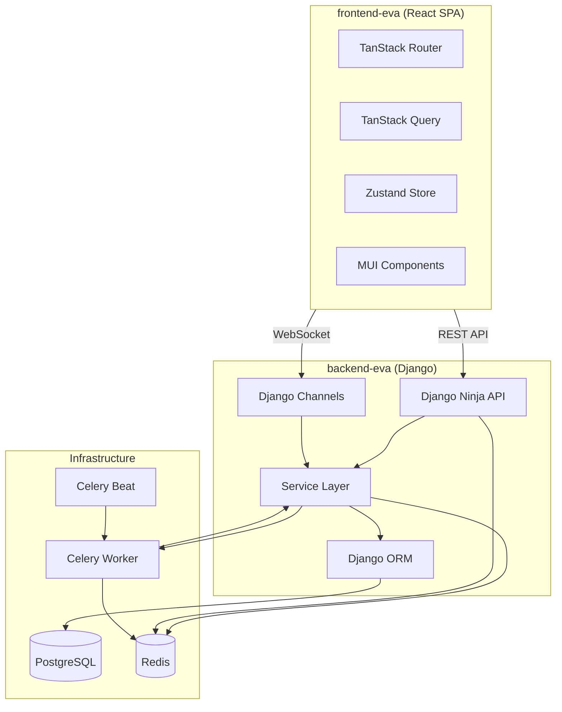
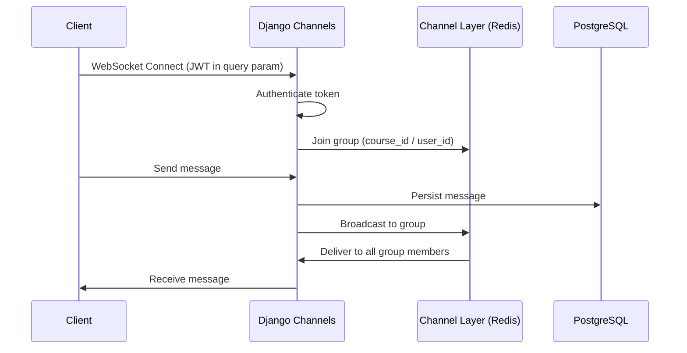
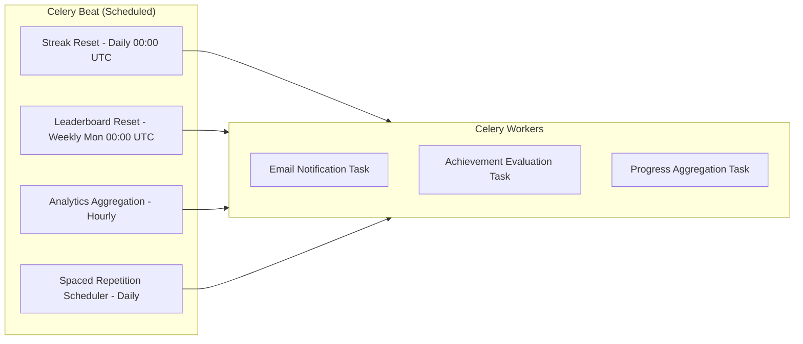
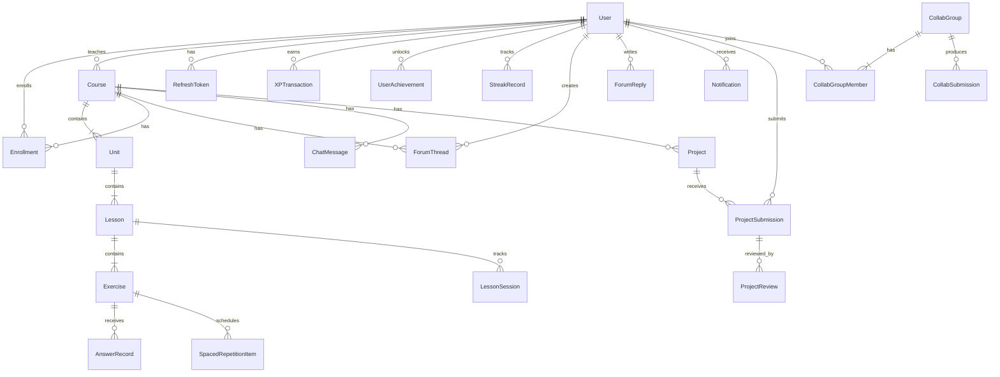

# Documento de Diseño Técnico — Plataforma de Aprendizaje EVA

## Descripción General

EVA (Entorno Virtual de Enseñanza-Aprendizaje) es una plataforma de aprendizaje de nivel de producción que combina cuatro modelos pedagógicos en un solo sistema: Conductismo (gamificación), Cognitivismo (aprendizaje adaptativo), Conectivismo (funciones sociales) y Constructivismo (proyectos colaborativos). La plataforma es una aplicación web de dos niveles con un backend en Django que expone una API REST + WebSocket y un frontend SPA en React.

El backend sigue una arquitectura modular de aplicaciones Django con un patrón de capa de servicios. Cada dominio (accounts, courses, exercises, gamification, progress, social, projects, collaboration, notifications) es una aplicación Django aislada con sus propios modelos, servicios, esquemas y rutas de API. La comunicación entre dominios ocurre a través de importaciones de la capa de servicios, nunca mediante acceso directo a modelos entre aplicaciones.

El frontend es una aplicación React basada en funcionalidades que utiliza TanStack Router (enrutamiento basado en archivos), TanStack Query (estado del servidor), Zustand (estado del cliente), MUI (biblioteca de componentes) y módulos CSS (estilos). Se comunica con el backend mediante REST para operaciones CRUD y WebSocket para funcionalidades en tiempo real (chat, notificaciones, espacios de trabajo colaborativos).

### Decisiones Arquitectónicas Clave

- **Django Ninja** sobre DRF: Esquemas nativos de Pydantic, soporte asíncrono, generación de OpenAPI y mejor seguridad de tipos con MyPy.
- **Patrón de capa de servicios**: Las rutas de API delegan a funciones de servicio. Los modelos nunca se acceden directamente desde las vistas. Esto permite testabilidad y separación de responsabilidades.
- **Rotación de tokens con seguimiento de familias**: Los tokens de actualización utilizan un ID de familia para detectar ataques de repetición. La reutilización de un token ya rotado invalida toda la familia.
- **Redis para caché + pub/sub**: Las tablas de clasificación usan conjuntos ordenados de Redis. El Channel Layer usa Redis para el enrutamiento de mensajes WebSocket. La limitación de tasa usa contadores de Redis.
- **Celery para trabajo asíncrono**: Notificaciones por correo electrónico, reinicio de rachas, reinicio de tablas de clasificación, agregación de analíticas y programación de repetición espaciada se ejecutan como tareas de Celery.
- **Pydantic en todas partes**: Esquemas de solicitud/respuesta (Django Ninja), configuración (pydantic-settings) y DTOs internos usan Pydantic para validación y seguridad de tipos.



## Arquitectura

### Arquitectura del Backend

El backend está organizado como un proyecto Django (`backend-eva`) con la siguiente estructura de aplicaciones:

```
backend-eva/
├── config/                  # Configuración del proyecto Django
│   ├── settings.py          # Configuración basada en pydantic-settings
│   ├── urls.py              # Configuración raíz de URLs montando Django Ninja
│   ├── asgi.py              # Aplicación ASGI con enrutamiento de Channels
│   ├── wsgi.py
│   └── celery.py            # Configuración de la aplicación Celery
├── apps/
│   ├── accounts/            # Autenticación, usuarios, roles, tokens
│   ├── courses/             # Jerarquía Curso → Unidad → Lección, inscripción
│   ├── exercises/           # Tipos de ejercicios, validación, reproductor de lecciones
│   ├── gamification/        # XP, niveles, rachas, logros, tablas de clasificación
│   ├── progress/            # Seguimiento del progreso del estudiante, analíticas
│   ├── social/              # Foros, chat en tiempo real
│   ├── projects/            # Proyectos del mundo real, rúbricas, revisión entre pares
│   ├── collaboration/       # Ejercicios grupales, espacios de trabajo compartidos
│   └── notifications/       # Notificaciones en la aplicación + correo electrónico
├── common/                  # Utilidades compartidas, modelos base, permisos
│   ├── models.py            # Modelo base TimestampedModel
│   ├── permissions.py       # Clases de permisos basados en roles
│   ├── pagination.py        # Paginación por cursor/desplazamiento
│   ├── sanitization.py      # Utilidades de sanitización XSS
│   └── rate_limiting.py     # Limitador de tasa basado en Redis
└── manage.py
```

Cada aplicación sigue esta estructura interna:

```
apps/{app_name}/
├── models.py          # Modelos de Django
├── services.py        # Lógica de negocio (capa de servicios)
├── schemas.py         # Esquemas Pydantic (DTOs de solicitud/respuesta)
├── api.py             # Endpoints del router de Django Ninja
├── tasks.py           # Tareas de Celery (si aplica)
├── consumers.py       # Consumidores de Django Channels (si aplica)
├── admin.py           # Registro en el admin de Django
└── tests/
    ├── test_services.py
    ├── test_api.py
    └── test_properties.py  # Pruebas basadas en propiedades
```

### Patrón de Capa de Servicios

Toda la lógica de negocio reside en `services.py`. Las rutas de API y los consumidores de Channels son envoltorios delgados que validan la entrada, llaman a funciones de servicio y devuelven respuestas.

```python
# Example: apps/courses/api.py
@router.post("/courses", response=CourseOut)
def create_course(request, payload: CourseCreateIn) -> CourseOut:
    course = CourseService.create_course(
        teacher=request.auth, data=payload
    )
    return CourseOut.from_orm(course)

# Example: apps/courses/services.py
class CourseService:
    @staticmethod
    def create_course(teacher: User, data: CourseCreateIn) -> Course:
        # Business logic, validation, model creation
        ...
```

### Arquitectura del Frontend

```
frontend-eva/
├── src/
│   ├── app/                    # Shell de la aplicación, proveedores, tema
│   │   ├── App.tsx
│   │   ├── providers.tsx       # Proveedores de QueryClient, Router, Theme
│   │   └── theme.ts            # Tema personalizado de MUI
│   ├── routes/                 # Rutas basadas en archivos de TanStack Router
│   │   ├── __root.tsx          # Layout raíz con Suspense
│   │   ├── index.tsx           # Página de inicio
│   │   ├── login.tsx
│   │   ├── register.tsx
│   │   ├── dashboard/
│   │   │   └── index.tsx       # Panel del estudiante
│   │   ├── courses/
│   │   │   ├── index.tsx       # Listado de cursos
│   │   │   ├── $courseId.tsx    # Detalle del curso
│   │   │   └── $courseId/
│   │   │       ├── lessons/
│   │   │       │   └── $lessonId.tsx  # Reproductor de lecciones
│   │   │       ├── forum.tsx
│   │   │       └── chat.tsx
│   │   ├── teacher/
│   │   │   ├── index.tsx       # Panel del profesor
│   │   │   ├── courses/
│   │   │   │   └── $courseId/
│   │   │   │       └── builder.tsx  # Constructor de cursos
│   │   │   └── analytics/
│   │   │       └── $courseId.tsx
│   │   ├── projects/
│   │   │   ├── index.tsx
│   │   │   └── $projectId.tsx
│   │   └── profile/
│   │       └── index.tsx       # Perfil + logros
│   ├── features/               # Módulos de funcionalidades
│   │   ├── auth/
│   │   │   ├── api.ts          # Llamadas a la API de autenticación
│   │   │   ├── store.ts        # Store de Zustand para autenticación
│   │   │   ├── hooks.ts        # Hooks useAuth, useUser
│   │   │   └── components/
│   │   ├── courses/
│   │   │   ├── api.ts
│   │   │   ├── hooks.ts
│   │   │   ├── types.ts
│   │   │   └── components/
│   │   ├── exercises/
│   │   ├── gamification/
│   │   ├── social/
│   │   ├── projects/
│   │   ├── collaboration/
│   │   ├── notifications/
│   │   └── progress/
│   ├── shared/                 # Componentes de UI compartidos
│   │   ├── components/         # Componentes presentacionales
│   │   ├── hooks/              # Hooks compartidos
│   │   ├── utils/              # Funciones utilitarias
│   │   └── types/              # Tipos TypeScript compartidos
│   └── lib/
│       ├── api-client.ts       # Instancia de Axios con interceptores
│       └── websocket.ts        # Gestor de conexiones WebSocket
├── index.html
├── vite.config.ts
├── tsconfig.json
└── package.json
```

### Cliente API con Actualización de Tokens

El cliente API del frontend utiliza interceptores de Axios para manejar la actualización automática de tokens:

```typescript
// lib/api-client.ts
const apiClient = axios.create({ baseURL: '/api/v1', withCredentials: true });

apiClient.interceptors.response.use(
  (response) => response,
  async (error) => {
    if (error.response?.status === 401 && !error.config._retry) {
      error.config._retry = true;
      const { accessToken } = await refreshToken(); // POST /auth/refresh (cookie)
      useAuthStore.getState().setAccessToken(accessToken);
      error.config.headers.Authorization = `Bearer ${accessToken}`;
      return apiClient(error.config);
    }
    return Promise.reject(error);
  }
);
```

### Arquitectura WebSocket

Django Channels maneja dos casos de uso de WebSocket:

1. **Chat del Curso** (`ws://host/ws/chat/{course_id}/`): Mensajería en tiempo real por sala de curso.
2. **Notificaciones** (`ws://host/ws/notifications/`): Entrega de notificaciones por usuario.
3. **Colaboración** (`ws://host/ws/collab/{exercise_id}/{group_id}/`): Actualizaciones del espacio de trabajo compartido.



### Arquitectura de Tareas Celery



## Componentes e Interfaces

### Rutas de API del Backend (Django Ninja)

Todas las rutas de API están versionadas bajo `/api/v1/`. Cada aplicación registra un router.

#### accounts (Autenticación)
| Método | Endpoint | Autenticación | Descripción |
|--------|----------|---------------|-------------|
| POST | `/auth/register` | Ninguna | Registrar nuevo usuario |
| POST | `/auth/login` | Ninguna | Iniciar sesión, devuelve tokens de acceso + actualización |
| POST | `/auth/logout` | Bearer | Cerrar sesión, invalidar token de actualización |
| POST | `/auth/refresh` | Cookie | Rotar tokens |
| GET | `/auth/me` | Bearer | Obtener perfil del usuario actual |
| PATCH | `/users/{id}/role` | Admin | Cambiar rol de usuario |

#### courses
| Método | Endpoint | Autenticación | Descripción |
|--------|----------|---------------|-------------|
| GET | `/courses` | Bearer | Listar cursos publicados (Estudiante) o cursos propios (Profesor) |
| POST | `/courses` | Teacher | Crear curso |
| GET | `/courses/{id}` | Bearer | Detalle del curso con unidades/lecciones |
| PATCH | `/courses/{id}` | Teacher+Owner | Actualizar curso |
| POST | `/courses/{id}/publish` | Teacher+Owner | Publicar curso |
| POST | `/courses/{id}/units` | Teacher+Owner | Agregar unidad |
| PATCH | `/units/{id}` | Teacher+Owner | Actualizar unidad |
| POST | `/units/{id}/lessons` | Teacher+Owner | Agregar lección |
| PATCH | `/lessons/{id}` | Teacher+Owner | Actualizar lección |
| POST | `/courses/{id}/enroll` | Student | Inscribirse en el curso |
| DELETE | `/courses/{id}/enroll` | Student | Desinscribirse del curso |
| GET | `/enrollments` | Student | Listar cursos inscritos con progreso |

#### exercises
| Método | Endpoint | Autenticación | Descripción |
|--------|----------|---------------|-------------|
| POST | `/lessons/{id}/exercises` | Teacher+Owner | Crear ejercicio |
| PATCH | `/exercises/{id}` | Teacher+Owner | Actualizar ejercicio |
| DELETE | `/exercises/{id}` | Teacher+Owner | Eliminar ejercicio |
| GET | `/lessons/{id}/start` | Student+Enrolled | Iniciar sesión del reproductor de lecciones |
| POST | `/exercises/{id}/submit` | Student+Enrolled | Enviar respuesta |
| GET | `/lessons/{id}/resume` | Student+Enrolled | Reanudar lección desde el progreso guardado |

#### gamification
| Método | Endpoint | Autenticación | Descripción |
|--------|----------|---------------|-------------|
| GET | `/gamification/profile` | Bearer | XP, nivel, racha, logros |
| GET | `/gamification/leaderboard` | Bearer | Tabla de clasificación (consulta: period=weekly\|alltime) |
| GET | `/gamification/achievements` | Bearer | Todos los logros con estado de desbloqueo |
| GET | `/gamification/xp-history` | Bearer | Registro de transacciones de XP |

#### progress
| Método | Endpoint | Autenticación | Descripción |
|--------|----------|---------------|-------------|
| GET | `/progress/dashboard` | Student | Estadísticas generales de progreso |
| GET | `/progress/courses/{id}` | Student+Enrolled | Detalle de progreso por curso |
| GET | `/progress/activity` | Student | Datos del mapa de calor de actividad (90 días) |
| GET | `/progress/mastery` | Student | Puntuaciones de dominio por tema |

#### social
| Método | Endpoint | Autenticación | Descripción |
|--------|----------|---------------|-------------|
| GET | `/courses/{id}/forum/threads` | Bearer+Enrolled | Listar hilos del foro (paginado) |
| POST | `/courses/{id}/forum/threads` | Bearer+Enrolled | Crear hilo |
| GET | `/forum/threads/{id}` | Bearer+Enrolled | Detalle del hilo con respuestas |
| POST | `/forum/threads/{id}/replies` | Bearer+Enrolled | Responder al hilo |
| POST | `/forum/posts/{id}/flag` | Teacher\|Admin | Marcar publicación |
| POST | `/forum/replies/{id}/upvote` | Bearer+Enrolled | Alternar voto positivo |

#### projects
| Método | Endpoint | Autenticación | Descripción |
|--------|----------|---------------|-------------|
| POST | `/projects` | Teacher | Crear proyecto |
| GET | `/projects/{id}` | Bearer+Enrolled | Detalle del proyecto |
| POST | `/projects/{id}/submit` | Student+Enrolled | Enviar proyecto (multipart) |
| POST | `/submissions/{id}/review` | Teacher | Revisión del profesor con puntuaciones de rúbrica |
| POST | `/submissions/{id}/peer-review` | Student | Revisión entre pares |
| GET | `/submissions/{id}/reviews` | Bearer | Obtener revisiones de la entrega |

#### collaboration
| Método | Endpoint | Autenticación | Descripción |
|--------|----------|---------------|-------------|
| POST | `/exercises/{id}/collab/join` | Student+Enrolled | Unirse al ejercicio colaborativo |
| POST | `/collab/groups/{id}/submit` | Student+GroupMember | Enviar trabajo grupal |
| GET | `/collab/groups/{id}` | Student+GroupMember | Obtener información del grupo y estado del espacio de trabajo |

#### notifications
| Método | Endpoint | Autenticación | Descripción |
|--------|----------|---------------|-------------|
| GET | `/notifications` | Bearer | Listar notificaciones (paginado) |
| GET | `/notifications/unread-count` | Bearer | Cantidad de notificaciones no leídas |
| POST | `/notifications/{id}/read` | Bearer | Marcar notificación como leída |
| POST | `/notifications/read-all` | Bearer | Marcar todas como leídas |

#### Analíticas del profesor
| Método | Endpoint | Autenticación | Descripción |
|--------|----------|---------------|-------------|
| GET | `/teacher/courses/{id}/analytics` | Teacher+Owner | Estadísticas agregadas del curso |
| GET | `/teacher/courses/{id}/students` | Teacher+Owner | Lista de estudiantes con progreso |
| GET | `/teacher/courses/{id}/students/{sid}` | Teacher+Owner | Progreso detallado del estudiante |
| GET | `/teacher/courses/{id}/heatmap` | Teacher+Owner | Mapa de calor de precisión de ejercicios |

### Endpoints WebSocket (Django Channels)

| Endpoint | Autenticación | Descripción |
|----------|---------------|-------------|
| `ws/chat/{course_id}/` | JWT query param | Sala de chat del curso |
| `ws/notifications/` | JWT query param | Flujo de notificaciones del usuario |
| `ws/collab/{exercise_id}/{group_id}/` | JWT query param | Espacio de trabajo colaborativo |

### Interfaces Clave de Servicios

```python
# accounts/services.py
class AuthService:
    def register(data: RegisterIn) -> User
    def login(data: LoginIn) -> TokenPair
    def logout(user: User, refresh_token: str) -> None
    def refresh_tokens(refresh_token: str) -> TokenPair
    def change_role(admin: User, target_user_id: int, new_role: Role) -> User

# courses/services.py
class CourseService:
    def create_course(teacher: User, data: CourseCreateIn) -> Course
    def publish_course(teacher: User, course_id: int) -> Course
    def reorder_units(teacher: User, course_id: int, order: list[int]) -> None
    def enroll(student: User, course_id: int) -> Enrollment
    def unenroll(student: User, course_id: int) -> None

# exercises/services.py
class ExerciseService:
    def create_exercise(teacher: User, lesson_id: int, data: ExerciseCreateIn) -> Exercise
    def start_lesson(student: User, lesson_id: int) -> LessonSession
    def submit_answer(student: User, exercise_id: int, answer: AnswerIn) -> AnswerResult
    def resume_lesson(student: User, lesson_id: int) -> LessonSession

# gamification/services.py
class GamificationService:
    def award_xp(student: User, source_type: str, source_id: int, amount: int) -> XPTransaction
    def check_level_up(student: User) -> LevelUpResult | None
    def evaluate_achievements(student: User) -> list[Achievement]
    def get_leaderboard(period: str, user: User) -> LeaderboardResult
    def update_streak(student: User) -> StreakResult
    def reset_expired_streaks() -> int  # Celery task entry point

# progress/services.py
class ProgressService:
    def initialize_course_progress(student: User, course_id: int) -> None
    def update_lesson_progress(student: User, lesson_id: int, score: float) -> None
    def get_dashboard(student: User) -> DashboardData
    def get_course_progress(student: User, course_id: int) -> CourseProgressData
    def get_activity_heatmap(student: User, days: int = 90) -> list[ActivityDay]

# adaptive/services.py (within exercises app)
class AdaptiveService:
    def record_answer(student: User, exercise: Exercise, correct: bool) -> None
    def get_mastery_scores(student: User, course_id: int) -> dict[int, float]
    def should_recommend_review(student: User, unit_id: int) -> ReviewRecommendation | None
    def generate_review_session(student: User, course_id: int) -> list[Exercise]
    def schedule_spaced_repetition(student: User, exercise: Exercise) -> None
```


## Modelos de Datos

Todos los modelos heredan de `TimestampedModel`, que proporciona los campos `created_at` y `updated_at` con marcas de tiempo automáticas.



### Aplicación accounts

```python
class Role(models.TextChoices):
    STUDENT = "student"
    TEACHER = "teacher"
    ADMIN = "admin"

class User(AbstractUser):
    """Extended user model with role and profile fields."""
    email = models.EmailField(unique=True)  # Used as login identifier
    display_name = models.CharField(max_length=100)
    role = models.CharField(max_length=10, choices=Role.choices, default=Role.STUDENT)
    timezone = models.CharField(max_length=50, default="UTC")
    # Auth via email, not username
    USERNAME_FIELD = "email"
    REQUIRED_FIELDS = ["display_name"]

class RefreshToken(TimestampedModel):
    """Tracks refresh tokens for rotation and replay detection."""
    user = models.ForeignKey(User, on_delete=models.CASCADE, related_name="refresh_tokens")
    token_hash = models.CharField(max_length=64, unique=True, db_index=True)  # SHA-256 hash
    family_id = models.UUIDField(db_index=True)  # Token family for replay detection
    is_revoked = models.BooleanField(default=False)
    expires_at = models.DateTimeField()

    class Meta:
        indexes = [
            models.Index(fields=["family_id", "is_revoked"]),
        ]
```

### Aplicación courses

```python
class Course(TimestampedModel):
    """Top-level content container."""
    class Status(models.TextChoices):
        DRAFT = "draft"
        PUBLISHED = "published"

    title = models.CharField(max_length=200)
    description = models.TextField()
    teacher = models.ForeignKey(User, on_delete=models.CASCADE, related_name="taught_courses")
    status = models.CharField(max_length=10, choices=Status.choices, default=Status.DRAFT)
    published_at = models.DateTimeField(null=True, blank=True)

class Unit(TimestampedModel):
    """Second level in Course → Unit → Lesson → Exercise hierarchy."""
    course = models.ForeignKey(Course, on_delete=models.CASCADE, related_name="units")
    title = models.CharField(max_length=200)
    order = models.PositiveIntegerField()

    class Meta:
        ordering = ["order"]
        unique_together = [("course", "order")]

class Lesson(TimestampedModel):
    """Third level. Contains exercises."""
    unit = models.ForeignKey(Unit, on_delete=models.CASCADE, related_name="lessons")
    title = models.CharField(max_length=200)
    order = models.PositiveIntegerField()

    class Meta:
        ordering = ["order"]
        unique_together = [("unit", "order")]

class Enrollment(TimestampedModel):
    """Links a Student to a Course."""
    student = models.ForeignKey(User, on_delete=models.CASCADE, related_name="enrollments")
    course = models.ForeignKey(Course, on_delete=models.CASCADE, related_name="enrollments")
    is_active = models.BooleanField(default=True)
    enrolled_at = models.DateTimeField(auto_now_add=True)

    class Meta:
        unique_together = [("student", "course")]
```

### Aplicación exercises

```python
class ExerciseType(models.TextChoices):
    MULTIPLE_CHOICE = "multiple_choice"
    FILL_BLANK = "fill_blank"
    MATCHING = "matching"
    FREE_TEXT = "free_text"

class Exercise(TimestampedModel):
    """An exercise within a lesson. Type-specific data stored in JSON fields."""
    lesson = models.ForeignKey(Lesson, on_delete=models.CASCADE, related_name="exercises")
    exercise_type = models.CharField(max_length=20, choices=ExerciseType.choices)
    question_text = models.TextField()
    order = models.PositiveIntegerField()
    # Type-specific configuration stored as JSON (validated by Pydantic schemas)
    config = models.JSONField()
    # e.g. multiple_choice: {"options": [...], "correct_index": 0}
    # e.g. fill_blank: {"blank_position": 3, "accepted_answers": ["answer1", "answer2"]}
    # e.g. matching: {"pairs": [{"left": "A", "right": "1"}, ...]}
    # e.g. free_text: {"model_answer": "...", "rubric": "..."}
    difficulty = models.PositiveSmallIntegerField(default=1)  # 1-5 scale
    topic = models.CharField(max_length=100, blank=True)  # For adaptive learning tagging
    is_collaborative = models.BooleanField(default=False)
    collab_group_size = models.PositiveSmallIntegerField(null=True, blank=True)  # 2-5

    class Meta:
        ordering = ["order"]
        unique_together = [("lesson", "order")]

class LessonSession(TimestampedModel):
    """Tracks a student's progress through a lesson player session."""
    student = models.ForeignKey(User, on_delete=models.CASCADE, related_name="lesson_sessions")
    lesson = models.ForeignKey(Lesson, on_delete=models.CASCADE, related_name="sessions")
    current_exercise_index = models.PositiveIntegerField(default=0)
    retry_queue = models.JSONField(default=list)  # Exercise IDs queued for retry
    is_completed = models.BooleanField(default=False)
    completed_at = models.DateTimeField(null=True, blank=True)
    correct_first_attempt = models.PositiveIntegerField(default=0)
    total_exercises = models.PositiveIntegerField(default=0)

    class Meta:
        unique_together = [("student", "lesson")]

class AnswerRecord(TimestampedModel):
    """Records each answer submission for analytics and adaptive learning."""
    student = models.ForeignKey(User, on_delete=models.CASCADE, related_name="answers")
    exercise = models.ForeignKey(Exercise, on_delete=models.CASCADE, related_name="answers")
    session = models.ForeignKey(LessonSession, on_delete=models.CASCADE, related_name="answers")
    submitted_answer = models.JSONField()  # Type-dependent answer data
    is_correct = models.BooleanField()
    is_first_attempt = models.BooleanField()
    answered_at = models.DateTimeField(auto_now_add=True)
```

### Aplicación gamification

```python
class GamificationProfile(TimestampedModel):
    """Aggregate gamification state for a student."""
    student = models.OneToOneField(User, on_delete=models.CASCADE, related_name="gamification_profile")
    total_xp = models.PositiveIntegerField(default=0)
    current_level = models.PositiveIntegerField(default=1)
    current_streak = models.PositiveIntegerField(default=0)
    longest_streak = models.PositiveIntegerField(default=0)
    last_activity_date = models.DateField(null=True, blank=True)

class XPTransaction(TimestampedModel):
    """Immutable log of every XP award."""
    student = models.ForeignKey(User, on_delete=models.CASCADE, related_name="xp_transactions")
    amount = models.PositiveIntegerField()
    source_type = models.CharField(max_length=50)  # "lesson", "achievement", "streak_bonus", "collab"
    source_id = models.PositiveIntegerField()  # ID of the source object
    timestamp = models.DateTimeField(auto_now_add=True)

class Achievement(TimestampedModel):
    """Achievement definition (system-wide)."""
    name = models.CharField(max_length=100, unique=True)
    description = models.TextField()
    icon = models.CharField(max_length=100)  # Icon identifier
    condition_type = models.CharField(max_length=50)  # "xp_total", "streak", "lessons_completed", etc.
    condition_value = models.PositiveIntegerField()  # Threshold value

class UserAchievement(TimestampedModel):
    """Tracks which achievements a student has unlocked."""
    student = models.ForeignKey(User, on_delete=models.CASCADE, related_name="achievements")
    achievement = models.ForeignKey(Achievement, on_delete=models.CASCADE, related_name="user_achievements")
    unlocked_at = models.DateTimeField(auto_now_add=True)

    class Meta:
        unique_together = [("student", "achievement")]
```

### Aplicación progress

```python
class CourseProgress(TimestampedModel):
    """Tracks a student's progress through a course."""
    student = models.ForeignKey(User, on_delete=models.CASCADE, related_name="course_progress")
    course = models.ForeignKey(Course, on_delete=models.CASCADE, related_name="student_progress")
    completion_percentage = models.FloatField(default=0.0)
    total_score = models.FloatField(default=0.0)
    lessons_completed = models.PositiveIntegerField(default=0)
    total_lessons = models.PositiveIntegerField(default=0)

    class Meta:
        unique_together = [("student", "course")]

class LessonProgress(TimestampedModel):
    """Tracks completion and score per lesson."""
    student = models.ForeignKey(User, on_delete=models.CASCADE, related_name="lesson_progress")
    lesson = models.ForeignKey(Lesson, on_delete=models.CASCADE, related_name="student_progress")
    is_completed = models.BooleanField(default=False)
    score = models.FloatField(default=0.0)  # Percentage correct
    completed_at = models.DateTimeField(null=True, blank=True)

    class Meta:
        unique_together = [("student", "lesson")]

class TopicMastery(TimestampedModel):
    """Adaptive learning: mastery score per topic per student."""
    student = models.ForeignKey(User, on_delete=models.CASCADE, related_name="topic_mastery")
    topic = models.CharField(max_length=100)
    course = models.ForeignKey(Course, on_delete=models.CASCADE, related_name="topic_mastery")
    correct_count = models.PositiveIntegerField(default=0)
    total_count = models.PositiveIntegerField(default=0)
    mastery_score = models.FloatField(default=0.0)  # Weighted by recency
    last_reviewed = models.DateTimeField(null=True, blank=True)

    class Meta:
        unique_together = [("student", "topic", "course")]

class SpacedRepetitionItem(TimestampedModel):
    """Schedules review exercises using spaced repetition intervals."""
    student = models.ForeignKey(User, on_delete=models.CASCADE, related_name="spaced_items")
    exercise = models.ForeignKey(Exercise, on_delete=models.CASCADE, related_name="spaced_items")
    next_review_date = models.DateField()
    interval_days = models.PositiveIntegerField(default=1)  # Current interval: 1, 3, 7, 14, 30
    review_count = models.PositiveIntegerField(default=0)

class DailyActivity(TimestampedModel):
    """Tracks daily learning activity for heatmap display."""
    student = models.ForeignKey(User, on_delete=models.CASCADE, related_name="daily_activities")
    date = models.DateField()
    lessons_completed = models.PositiveIntegerField(default=0)
    xp_earned = models.PositiveIntegerField(default=0)
    time_spent_minutes = models.PositiveIntegerField(default=0)

    class Meta:
        unique_together = [("student", "date")]
```

### Aplicación social

```python
class ForumThread(TimestampedModel):
    """A discussion thread in a course forum."""
    course = models.ForeignKey(Course, on_delete=models.CASCADE, related_name="forum_threads")
    author = models.ForeignKey(User, on_delete=models.CASCADE, related_name="forum_threads")
    title = models.CharField(max_length=200)
    body = models.TextField()
    is_hidden = models.BooleanField(default=False)
    last_activity_at = models.DateTimeField(auto_now_add=True)

    class Meta:
        ordering = ["-last_activity_at"]

class ForumReply(TimestampedModel):
    """A reply within a forum thread."""
    thread = models.ForeignKey(ForumThread, on_delete=models.CASCADE, related_name="replies")
    author = models.ForeignKey(User, on_delete=models.CASCADE, related_name="forum_replies")
    body = models.TextField()
    is_hidden = models.BooleanField(default=False)
    upvote_count = models.PositiveIntegerField(default=0)

class ReplyUpvote(TimestampedModel):
    """Tracks upvotes to prevent duplicates."""
    reply = models.ForeignKey(ForumReply, on_delete=models.CASCADE, related_name="upvotes")
    user = models.ForeignKey(User, on_delete=models.CASCADE, related_name="reply_upvotes")

    class Meta:
        unique_together = [("reply", "user")]

class ChatMessage(TimestampedModel):
    """Persisted chat message for a course chat room."""
    course = models.ForeignKey(Course, on_delete=models.CASCADE, related_name="chat_messages")
    author = models.ForeignKey(User, on_delete=models.CASCADE, related_name="chat_messages")
    content = models.TextField(max_length=2000)
    sent_at = models.DateTimeField(auto_now_add=True)

    class Meta:
        ordering = ["sent_at"]
```

### Aplicación projects

```python
class Project(TimestampedModel):
    """A real-world project assignment."""
    course = models.ForeignKey(Course, on_delete=models.CASCADE, related_name="projects")
    teacher = models.ForeignKey(User, on_delete=models.CASCADE, related_name="created_projects")
    title = models.CharField(max_length=200)
    description = models.TextField()
    rubric = models.JSONField()  # [{"criterion": "...", "max_score": 10, "description": "..."}, ...]
    submission_deadline = models.DateTimeField()
    peer_review_enabled = models.BooleanField(default=False)
    peer_reviewers_count = models.PositiveSmallIntegerField(default=2)

class ProjectSubmission(TimestampedModel):
    """A student's project submission."""
    project = models.ForeignKey(Project, on_delete=models.CASCADE, related_name="submissions")
    student = models.ForeignKey(User, on_delete=models.CASCADE, related_name="project_submissions")
    description = models.TextField()
    is_late = models.BooleanField(default=False)
    submitted_at = models.DateTimeField(auto_now_add=True)

    class Meta:
        unique_together = [("project", "student")]

class SubmissionFile(TimestampedModel):
    """File attached to a project submission. Max 5 files, 10MB each."""
    submission = models.ForeignKey(ProjectSubmission, on_delete=models.CASCADE, related_name="files")
    file = models.FileField(upload_to="project_submissions/%Y/%m/")
    filename = models.CharField(max_length=255)
    file_size = models.PositiveIntegerField()  # bytes

class ProjectReview(TimestampedModel):
    """Review of a project submission (teacher or peer)."""
    submission = models.ForeignKey(ProjectSubmission, on_delete=models.CASCADE, related_name="reviews")
    reviewer = models.ForeignKey(User, on_delete=models.CASCADE, related_name="project_reviews")
    review_type = models.CharField(max_length=10, choices=[("teacher", "Teacher"), ("peer", "Peer")])
    scores = models.JSONField()  # [{"criterion": "...", "score": 8}, ...]
    feedback = models.TextField()
    is_complete = models.BooleanField(default=False)

class PeerReviewAssignment(TimestampedModel):
    """Tracks peer review assignments."""
    submission = models.ForeignKey(ProjectSubmission, on_delete=models.CASCADE, related_name="peer_assignments")
    reviewer = models.ForeignKey(User, on_delete=models.CASCADE, related_name="peer_review_assignments")
    is_completed = models.BooleanField(default=False)

    class Meta:
        unique_together = [("submission", "reviewer")]
```

### Aplicación collaboration

```python
class CollabGroup(TimestampedModel):
    """A group formed for a collaborative exercise."""
    exercise = models.ForeignKey(Exercise, on_delete=models.CASCADE, related_name="collab_groups")
    max_size = models.PositiveSmallIntegerField()
    workspace_state = models.JSONField(default=dict)  # Shared workspace data
    is_submitted = models.BooleanField(default=False)

class CollabGroupMember(TimestampedModel):
    """Membership in a collaborative group."""
    group = models.ForeignKey(CollabGroup, on_delete=models.CASCADE, related_name="members")
    student = models.ForeignKey(User, on_delete=models.CASCADE, related_name="collab_memberships")
    joined_at = models.DateTimeField(auto_now_add=True)
    last_contribution_at = models.DateTimeField(null=True, blank=True)

    class Meta:
        unique_together = [("group", "student")]

class CollabSubmission(TimestampedModel):
    """Submission from a collaborative group."""
    group = models.ForeignKey(CollabGroup, on_delete=models.CASCADE, related_name="submissions")
    submitted_answer = models.JSONField()
    submitted_at = models.DateTimeField(auto_now_add=True)
```

### Aplicación notifications

```python
class Notification(TimestampedModel):
    """A notification record for a user."""
    class Channel(models.TextChoices):
        IN_APP = "in_app"
        EMAIL = "email"
        BOTH = "both"

    recipient = models.ForeignKey(User, on_delete=models.CASCADE, related_name="notifications")
    notification_type = models.CharField(max_length=50)  # "achievement", "forum_reply", "review", etc.
    title = models.CharField(max_length=200)
    body = models.TextField()
    data = models.JSONField(default=dict)  # Additional context (links, IDs)
    channel = models.CharField(max_length=10, choices=Channel.choices, default=Channel.IN_APP)
    is_read = models.BooleanField(default=False)
    email_sent = models.BooleanField(default=False)
```

### Estructuras de Datos en Redis

Además del caché y el Channel Layer, Redis se utiliza para:

| Patrón de Clave | Tipo | Propósito |
|-----------------|------|-----------|
| `leaderboard:weekly` | Sorted Set | Tabla de clasificación semanal de XP (member=user_id, score=xp) |
| `leaderboard:alltime` | Sorted Set | Tabla de clasificación histórica de XP |
| `rate_limit:{endpoint}:{ip}` | String (counter) | Limitación de tasa con TTL |
| `lesson_session:{user_id}:{lesson_id}` | Hash | Caché de sesión de lección activa |
| `user:{user_id}:unread_count` | String (counter) | Caché del conteo de notificaciones no leídas |


## Propiedades de Corrección

*Una propiedad es una característica o comportamiento que debe mantenerse verdadero en todas las ejecuciones válidas de un sistema — esencialmente, una declaración formal sobre lo que el sistema debe hacer. Las propiedades sirven como puente entre las especificaciones legibles por humanos y las garantías de corrección verificables por máquinas.*

### Propiedad 1: El registro crea una cuenta válida

*Para cualquier* entrada de registro válida (formato de correo electrónico válido, contraseña con ≥8 caracteres incluyendo mayúsculas, minúsculas y numéricos), el Auth_Service debe crear un nuevo usuario con el rol Student, y la contraseña almacenada nunca debe ser igual a la contraseña en texto plano (debe estar hasheada).

**Valida: Requisitos 1.1, 1.3**

### Propiedad 2: El registro rechaza entradas inválidas

*Para cualquier* entrada de registro donde el correo electrónico ya está en uso, el formato del correo electrónico es inválido, o la contraseña no cumple los requisitos de fortaleza (demasiado corta, faltan clases de caracteres), el Auth_Service debe rechazar el registro y el conteo total de usuarios debe permanecer sin cambios.

**Valida: Requisitos 1.2, 1.4, 1.5**

### Propiedad 3: El inicio de sesión devuelve un par de tokens bien formado

*Para cualquier* usuario registrado con credenciales válidas, el inicio de sesión debe devolver un Access_Token con una expiración de 15 minutos que contenga el rol del usuario en sus claims, y un Refresh_Token con una expiración de 7 días. Ambos tokens deben compartir un family_id.

**Valida: Requisitos 2.1, 2.3, 2.4, 3.4, 4.3**

### Propiedad 4: Las credenciales inválidas producen errores indistinguibles

*Para cualquier* intento de inicio de sesión con un correo electrónico incorrecto o una contraseña incorrecta, la respuesta de error debe ser idéntica en estructura y mensaje — el sistema no debe revelar qué campo fue incorrecto.

**Valida: Requisitos 2.2**

### Propiedad 5: El cierre de sesión invalida el token de actualización

*Para cualquier* usuario autenticado, después del cierre de sesión el Refresh_Token previamente válido debe ser rechazado por el endpoint de actualización, devolviendo 401.

**Valida: Requisitos 2.5**

### Propiedad 6: Ciclo completo de rotación de tokens

*Para cualquier* Refresh_Token válido, llamar al endpoint de actualización debe devolver un nuevo Access_Token y un nuevo Refresh_Token. El Refresh_Token anterior ya no debe ser válido. Usar el nuevo Refresh_Token debe tener éxito.

**Valida: Requisitos 3.1, 3.2**

### Propiedad 7: Detección de repetición de tokens de actualización

*Para cualquier* cadena de rotación de tokens donde el token A se rota al token B, reutilizar el token A debe invalidar TODOS los tokens en esa familia (incluyendo el token B), y ambos deben devolver 401 en usos posteriores.

**Valida: Requisitos 3.3**

### Propiedad 8: Aplicación del control de acceso basado en roles

*Para cualquier* usuario con rol X y cualquier endpoint de API restringido al rol Y (donde X ≠ Y), la solicitud debe devolver 403 Forbidden. Por el contrario, un usuario con el rol correcto debe recibir una respuesta exitosa.

**Valida: Requisitos 4.2**

### Propiedad 9: El cambio de rol invalida los tokens existentes

*Para cualquier* usuario cuyo rol es cambiado por un Admin, todos los Access_Tokens y Refresh_Tokens emitidos previamente para ese usuario deben ser rechazados en usos posteriores.

**Valida: Requisitos 4.4**

### Propiedad 10: Invariante de ordenamiento de la jerarquía de contenido

*Para cualquier* conjunto de unidades dentro de un curso o lecciones dentro de una unidad, después de cualquier secuencia de operaciones de agregar, eliminar o reordenar, los números de orden deben formar una secuencia contigua comenzando desde 1 sin huecos ni duplicados.

**Valida: Requisitos 5.3, 5.4, 5.5**

### Propiedad 11: Validación de publicación de curso

*Para cualquier* curso que se esté publicando, si alguna lección en alguna unidad contiene cero ejercicios, la operación de publicación debe fallar con un error de validación. Un curso donde cada lección tiene al menos un ejercicio y existe al menos una unidad debe publicarse exitosamente.

**Valida: Requisitos 5.2, 5.6**

### Propiedad 12: Visibilidad de cursos por rol

*Para cualquier* solicitud de listado de cursos, un Estudiante solo debe ver cursos publicados. Un Profesor debe ver todos los cursos que posee (tanto borradores como publicados) pero no los borradores de otros profesores.

**Valida: Requisitos 5.7, 5.8**

### Propiedad 13: Validación de configuración por tipo de ejercicio

*Para cualquier* solicitud de creación de ejercicio: opción múltiple debe tener ≥2 opciones y exactamente 1 respuesta correcta; completar espacios en blanco debe tener una posición de espacio y ≥1 respuesta aceptada; emparejamiento debe tener ≥2 pares; texto libre debe tener una rúbrica o respuesta modelo. Las configuraciones inválidas deben ser rechazadas.

**Valida: Requisitos 6.2, 6.3, 6.4, 6.5**

### Propiedad 14: Coincidencia insensible a mayúsculas en completar espacios en blanco

*Para cualquier* ejercicio de completar espacios en blanco y cualquier cadena de respuesta aceptada, enviar esa respuesta en cualquier combinación de mayúsculas/minúsculas debe evaluarse como correcta.

**Valida: Requisitos 6.3**

### Propiedad 15: Retroalimentación de ejercicios con calificación automática

*Para cualquier* envío a un ejercicio de opción múltiple, completar espacios en blanco o emparejamiento, la respuesta debe incluir un indicador booleano de corrección y, si es incorrecto, la respuesta correcta.

**Valida: Requisitos 6.6, 7.2, 7.3**

### Propiedad 16: Las respuestas incorrectas se agregan a la cola de reintentos

*Para cualquier* sesión de lección, cada ejercicio respondido incorrectamente debe aparecer en la cola de reintentos. Después de completar todos los ejercicios incluyendo los reintentos, la lección debe marcarse como completada.

**Valida: Requisitos 7.3, 7.4**

### Propiedad 17: Cálculo del progreso de la lección

*Para cualquier* sesión de lección con N ejercicios totales y M completados, el porcentaje de progreso debe ser igual a M/N × 100. Los ejercicios en la cola de reintentos cuentan para el total pero no para los completados hasta que se respondan correctamente.

**Valida: Requisitos 7.5**

### Propiedad 18: Ciclo completo de guardar y reanudar sesión de lección

*Para cualquier* sesión de lección abandonada antes de completarse, reanudar debe restaurar el estado exacto: mismo índice de ejercicio actual, misma cola de reintentos, mismos conteos de completitud.

**Valida: Requisitos 7.6**

### Propiedad 19: Otorgamiento de XP y registro de transacciones

*Para cualquier* lección completada, el XP otorgado debe ser igual a una función definida del número de respuestas correctas en el primer intento. Se debe crear un registro XPTransaction con la cantidad correcta, source_type="lesson", source_id=lesson_id, y una marca de tiempo.

**Valida: Requisitos 8.1, 8.5**

### Propiedad 20: Progresión de niveles

*Para cualquier* estudiante y cualquier otorgamiento de XP que cause que total_xp cruce un umbral de nivel, el current_level del estudiante debe avanzar exactamente el número de umbrales cruzados. El umbral de nivel para el nivel N debe seguir la fórmula de progresión definida.

**Valida: Requisitos 8.2, 8.3, 8.4**

### Propiedad 21: Incremento de racha e invariante

*Para cualquier* estudiante que complete una lección en un nuevo día calendario (basado en su zona horaria), la racha debe incrementarse en 1. El longest_streak siempre debe ser ≥ current_streak. El last_activity_date debe ser igual a hoy.

**Valida: Requisitos 9.1, 9.5**

### Propiedad 22: Reinicio de racha por inactividad

*Para cualquier* estudiante cuyo last_activity_date sea anterior a ayer (en su zona horaria), la tarea de reinicio de racha debe establecer current_streak en 0 mientras preserva longest_streak.

**Valida: Requisitos 9.2**

### Propiedad 23: Idempotencia en el otorgamiento de logros

*Para cualquier* estudiante y logro, otorgar el logro múltiples veces debe resultar en exactamente un registro UserAchievement. El segundo intento de otorgamiento debe ser una operación sin efecto.

**Valida: Requisitos 10.5**

### Propiedad 24: Desbloqueo de logro al cumplir la condición

*Para cualquier* logro con una condición numérica (por ejemplo, total_xp ≥ 1000, streak ≥ 7, lessons_completed ≥ 50), cuando las estadísticas de un estudiante cumplan o excedan la condición después de un evento que otorga XP, el logro debe ser concedido y se debe crear una notificación.

**Valida: Requisitos 10.2, 10.3, 9.4**

### Propiedad 25: Ordenamiento y completitud de la tabla de clasificación

*Para cualquier* conjunto de estudiantes con valores de XP, la tabla de clasificación debe devolver como máximo 100 entradas ordenadas por XP descendente. El rango y XP del estudiante solicitante siempre deben incluirse en la respuesta, incluso si no está en el top 100.

**Valida: Requisitos 11.2, 11.3**

### Propiedad 26: Cálculo de la puntuación de dominio

*Para cualquier* estudiante, tema y secuencia de registros de respuestas, la puntuación de dominio debe ser igual a la proporción ponderada de respuestas correctas sobre el total (ponderada por recencia). Agregar una respuesta correcta nunca debe disminuir la puntuación de dominio. Agregar una respuesta incorrecta nunca debe aumentarla.

**Valida: Requisitos 12.2**

### Propiedad 27: Umbral de recomendación de repaso

*Para cualquier* estudiante que inicie una lección en una unidad donde un tema prerrequisito tiene mastery_score < 0.6, el sistema debe recomendar una sesión de repaso. Si todos los temas prerrequisitos tienen mastery_score ≥ 0.6, no se debe recomendar ningún repaso.

**Valida: Requisitos 12.3**

### Propiedad 28: Programación de repetición espaciada

*Para cualquier* respuesta incorrecta, se debe crear un SpacedRepetitionItem con next_review_date = hoy + 1 día. Después de cada repaso posterior, el intervalo debe progresar a través de [1, 3, 7, 14, 30] días.

**Valida: Requisitos 12.4**

### Propiedad 29: Selección de ejercicios para sesión de repaso

*Para cualquier* sesión de repaso generada, todos los ejercicios seleccionados deben pertenecer a temas donde la mastery_score del estudiante está por debajo del umbral. Los ejercicios de temas con puntuaciones de dominio más bajas deben aparecer antes que los de puntuaciones más altas.

**Valida: Requisitos 12.5**

### Propiedad 30: Ajuste adaptativo de dificultad

*Para cualquier* estudiante en una sesión de lección, después de 3 respuestas correctas consecutivas el siguiente ejercicio debe ser de dificultad igual o mayor. Después de 2 respuestas incorrectas consecutivas el siguiente ejercicio debe ser de dificultad igual o menor.

**Valida: Requisitos 12.6**

### Propiedad 31: Ordenamiento de hilos del foro

*Para cualquier* foro de curso, los hilos deben devolverse ordenados por last_activity_at descendente. Agregar una respuesta a un hilo debe actualizar el last_activity_at de ese hilo, causando que se mueva al inicio.

**Valida: Requisitos 13.4**

### Propiedad 32: Marcar publicación del foro oculta el contenido

*Para cualquier* publicación del foro marcada (hilo o respuesta), no debe aparecer en los listados públicos. El autor de la publicación debe recibir una notificación.

**Valida: Requisitos 13.5**

### Propiedad 33: Historial de chat al conectar

*Para cualquier* sala de chat de curso con N mensajes (N ≥ 0), conectarse debe entregar min(N, 50) mensajes, y deben ser los más recientes en orden cronológico.

**Valida: Requisitos 14.3**

### Propiedad 34: Ciclo completo de persistencia de mensajes de chat

*Para cualquier* mensaje de chat enviado a través del WebSocket, debe persistirse en la base de datos. Consultar la base de datos para los mensajes de ese curso debe incluir el mensaje enviado con contenido, autor y curso coincidentes.

**Valida: Requisitos 14.4**

### Propiedad 35: Aplicación de inscripción en sala de chat

*Para cualquier* usuario no inscrito en un curso, intentar conectarse al WebSocket de chat de ese curso debe ser rechazado. Los usuarios inscritos deben conectarse exitosamente.

**Valida: Requisitos 14.5**

### Propiedad 36: Completitud de la lista de cursos del panel del profesor

*Para cualquier* profesor, la lista de cursos del panel debe incluir todos los cursos propiedad de ese profesor, cada uno con el estado correcto, conteo de inscripciones (coincidiendo con los registros reales de Enrollment) y fecha de última modificación.

**Valida: Requisitos 15.1**

### Propiedad 37: Precisión de las analíticas agregadas del profesor

*Para cualquier* curso con estudiantes inscritos, las estadísticas agregadas (total inscritos, tasa promedio de completitud, puntuación promedio) deben ser matemáticamente consistentes con los registros subyacentes de CourseProgress y LessonProgress.

**Valida: Requisitos 16.1**

### Propiedad 38: Consistencia del detalle de progreso del estudiante

*Para cualquier* profesor que visualice el progreso de un estudiante en un curso, la vista detallada debe mostrar el estado de completitud y puntuación por unidad y lección que coincida con los registros reales de LessonProgress para ese estudiante.

**Valida: Requisitos 16.2, 16.3**

### Propiedad 39: Asignación de grupo colaborativo

*Para cualquier* estudiante que se una a un ejercicio colaborativo, debe ser asignado a un grupo con espacios disponibles (miembros actuales < max_size). Si no existe tal grupo, se debe crear uno nuevo. Ningún grupo debe exceder nunca su max_size.

**Valida: Requisitos 17.2**

### Propiedad 40: El envío colaborativo otorga XP igual

*Para cualquier* envío grupal a un ejercicio colaborativo, cada miembro del grupo debe recibir un XPTransaction con la misma cantidad.

**Valida: Requisitos 17.4**

### Propiedad 41: Marcado de entrega tardía de proyecto

*Para cualquier* entrega de proyecto, si submitted_at > project.submission_deadline, el campo is_late de la entrega debe ser True. Si submitted_at ≤ deadline, is_late debe ser False.

**Valida: Requisitos 18.3**

### Propiedad 42: Asignación de revisión entre pares

*Para cualquier* proyecto con peer_review_enabled=True y N entregas (N ≥ 3), después de la fecha límite cada entrega debe ser asignada a exactamente peer_reviewers_count (por defecto 2) otros estudiantes como revisores. Ningún estudiante debe revisar su propia entrega.

**Valida: Requisitos 18.5**

### Propiedad 43: Visibilidad de revisión entre pares

*Para cualquier* entrega con revisiones entre pares asignadas, las revisiones solo deben ser visibles para el autor de la entrega cuando todas las revisiones asignadas estén marcadas como completas.

**Valida: Requisitos 18.6**

### Propiedad 44: Consistencia del conteo de notificaciones no leídas

*Para cualquier* usuario, el conteo de notificaciones no leídas debe ser igual al número de registros Notification donde recipient=user e is_read=False. Marcar una notificación como leída debe decrementar este conteo en exactamente 1.

**Valida: Requisitos 19.4, 19.5**

### Propiedad 45: Consistencia del panel de progreso del estudiante

*Para cualquier* estudiante, el panel de progreso debe devolver total_xp coincidiendo con GamificationProfile.total_xp, current_level coincidiendo con GamificationProfile.current_level, current_streak coincidiendo con GamificationProfile.current_streak, y courses_enrolled/completed coincidiendo con los registros reales de Enrollment.

**Valida: Requisitos 20.1**

### Propiedad 46: Rango de datos del mapa de calor de actividad

*Para cualquier* estudiante que solicite el mapa de calor de actividad, los datos devueltos deben cubrir exactamente los últimos 90 días calendario, con una entrada por día. Los días sin actividad deben tener valores en cero.

**Valida: Requisitos 20.4**

### Propiedad 47: Aplicación de limitación de tasa

*Para cualquier* dirección IP que realice solicitudes a un endpoint con limitación de tasa, las primeras N solicitudes dentro de la ventana deben tener éxito (N=10 para login, N=5 para registro). La solicitud N+1 debe devolver 429 con un encabezado Retry-After.

**Valida: Requisitos 21.1, 21.2, 21.3**

### Propiedad 48: Sanitización XSS

*Para cualquier* contenido de texto generado por el usuario que contenga etiquetas HTML o JavaScript, el contenido almacenado debe tener los elementos peligrosos eliminados o escapados. Recuperar el contenido nunca debe contener etiquetas de script ejecutables.

**Valida: Requisitos 21.5**

### Propiedad 49: Unicidad y ciclo de vida de la inscripción

*Para cualquier* estudiante y curso, solo puede existir una inscripción activa. Intentar inscribirse dos veces debe fallar. Desinscribirse debe establecer is_active=False pero preservar todos los datos de progreso. Reinscribirse debe reactivar el registro existente.

**Valida: Requisitos 22.1, 22.2, 22.5**

### Propiedad 50: La inscripción inicializa el progreso

*Para cualquier* nueva inscripción, se deben crear registros CourseProgress y LessonProgress para cada unidad y lección del curso. El conteo de registros LessonProgress debe ser igual al número total de lecciones en el curso.

**Valida: Requisitos 22.3**

### Propiedad 51: Almacenamiento del token de acceso solo en memoria en el frontend

*Para cualquier* flujo de autenticación en el frontend, el Access_Token debe existir solo en el store de Zustand (memoria). Después del inicio de sesión, localStorage y sessionStorage no deben contener ningún valor de token.

**Valida: Requisitos 24.7**

### Propiedad 52: Actualización automática de token ante 401

*Para cualquier* solicitud de API que reciba una respuesta 401, el cliente API debe llamar automáticamente al endpoint de actualización, actualizar el store de Zustand con el nuevo Access_Token, y reintentar la solicitud original exactamente una vez.

**Valida: Requisitos 24.8**


## Manejo de Errores

### Estrategia de Errores del Backend

Todos los errores se devuelven como respuestas JSON estructuradas a través del manejo de excepciones de Django Ninja.

#### Formato Estándar de Respuesta de Error

```python
class ErrorResponse(Schema):
    detail: str
    code: str  # Machine-readable error code
    errors: list[FieldError] | None = None  # Field-level validation errors

class FieldError(Schema):
    field: str
    message: str
```

#### Uso de Códigos de Estado HTTP

| Estado | Uso |
|--------|-----|
| 400 | Errores de validación (fallos de esquema Pydantic, violaciones de reglas de negocio) |
| 401 | Fallos de autenticación (tokens faltantes/expirados/inválidos) |
| 403 | Fallos de autorización (rol insuficiente, no es propietario, no está inscrito) |
| 404 | Recurso no encontrado |
| 409 | Conflicto (inscripción duplicada, correo electrónico duplicado) |
| 413 | Carga útil demasiado grande (archivo excede 10MB) |
| 422 | Entidad no procesable (JSON válido pero semánticamente inválido) |
| 429 | Límite de tasa excedido |
| 500 | Errores inesperados del servidor |

#### Manejo de Errores por Capa

**Capa de API (rutas de Django Ninja)**:
- Los errores de validación de esquemas Pydantic se capturan automáticamente y se devuelven como 400/422.
- Clases de excepción personalizadas para errores de dominio:

```python
class DomainError(Exception):
    """Base for all domain-specific errors."""
    status_code: int = 400
    code: str = "domain_error"

class DuplicateEmailError(DomainError):
    status_code = 409
    code = "duplicate_email"

class InvalidCredentialsError(DomainError):
    status_code = 401
    code = "invalid_credentials"

class InsufficientRoleError(DomainError):
    status_code = 403
    code = "insufficient_role"

class NotEnrolledError(DomainError):
    status_code = 403
    code = "not_enrolled"

class CourseNotPublishedError(DomainError):
    status_code = 400
    code = "course_not_published"

class PublishValidationError(DomainError):
    status_code = 422
    code = "publish_validation_failed"

class RateLimitExceededError(DomainError):
    status_code = 429
    code = "rate_limit_exceeded"

class FileTooLargeError(DomainError):
    status_code = 413
    code = "file_too_large"

class TooManyFilesError(DomainError):
    status_code = 400
    code = "too_many_files"
```

**Capa de Servicios**:
- Los servicios lanzan excepciones de dominio. Nunca devuelven respuestas HTTP directamente.
- Los servicios capturan errores a nivel de base de datos (IntegrityError) y los traducen a excepciones de dominio.
- Todos los métodos de servicio que modifican estado usan `@transaction.atomic` para garantizar consistencia.

**Tareas Celery**:
- Las tareas de notificación por correo electrónico usan `autoretry_for=(SMTPException, ConnectionError)` con `retry_backoff=True`, `max_retries=3` y `retry_backoff_max=300`.
- Las tareas fallidas después del máximo de reintentos se registran en una cola de mensajes muertos para inspección manual.
- Las tareas periódicas (reinicio de rachas, reinicio de tablas de clasificación, agregación de analíticas) usan `acks_late=True` y `reject_on_worker_lost=True` para confiabilidad.

**WebSocket (Django Channels)**:
- Los fallos de autenticación durante el handshake de WebSocket cierran la conexión con código 4001 (no autorizado).
- Los fallos de verificación de inscripción cierran con código 4003 (prohibido).
- Los mensajes malformados se descartan silenciosamente con un registro de advertencia.
- Los errores de conexión activan la reconexión del lado del cliente con retroceso exponencial (1s, 2s, 4s, 8s, máximo 30s).

### Estrategia de Errores del Frontend

**Cliente API (interceptores de Axios)**:
- Las respuestas 401 activan la actualización automática de tokens (una vez por solicitud). Si la actualización falla, se redirige al inicio de sesión.
- Las respuestas 403 muestran una notificación de "acceso denegado".
- Las respuestas 429 muestran una notificación de "por favor espere" con el valor de Retry-After.
- Las respuestas 5xx muestran una notificación genérica de "algo salió mal".
- Los errores de red muestran un indicador de "sin conexión".

**Manejo de Errores con TanStack Query**:
- Callback global `onError` en QueryClient para notificaciones tipo toast.
- `retry: 3` por consulta con retroceso exponencial para fallos transitorios.
- `retry: false` para mutaciones (sin reintento automático en operaciones de escritura).

**Validación de Formularios (React Hook Form + Zod)**:
- Validación del lado del cliente mediante esquemas Zod que coinciden con los esquemas Pydantic del backend.
- Los errores de validación del servidor se mapean a campos del formulario mediante `setError`.

**Manejo de Errores WebSocket**:
- Reconexión automática con retroceso exponencial al desconectarse.
- Cola de mensajes para mensajes enviados durante la reconexión, vaciada al reconectar.
- Detección de conexión obsoleta mediante ping/pong periódico (cada 30 segundos).

## Estrategia de Pruebas

### Enfoque de Pruebas Dual

El proyecto utiliza tanto pruebas unitarias como pruebas basadas en propiedades para una cobertura integral:

- **Pruebas unitarias** (pytest + pytest-django): Ejemplos específicos, casos límite, puntos de integración, condiciones de error.
- **Pruebas basadas en propiedades** (Hypothesis): Propiedades universales a través de entradas generadas aleatoriamente, verificando las garantías de corrección del documento de diseño.

Ambas son complementarias y necesarias. Las pruebas unitarias detectan errores concretos con entradas conocidas. Las pruebas de propiedades verifican la corrección general a través del espacio de entradas.

### Pruebas del Backend

**Framework**: pytest + pytest-django + hypothesis

**Organización de Pruebas**:
```
apps/{app_name}/tests/
├── test_services.py       # Pruebas unitarias para la capa de servicios
├── test_api.py            # Pruebas de integración para endpoints de API
├── test_properties.py     # Pruebas basadas en propiedades (Hypothesis)
├── test_consumers.py      # Pruebas de consumidores WebSocket (si aplica)
├── test_tasks.py          # Pruebas de tareas Celery (si aplica)
└── conftest.py            # Fixtures (usuarios, cursos, etc.)
```

**Configuración de Pruebas Basadas en Propiedades**:
- Biblioteca: **Hypothesis** (biblioteca PBT de Python)
- Cada prueba de propiedad ejecuta un mínimo de **100 iteraciones** (`@settings(max_examples=100)`)
- Cada prueba de propiedad está etiquetada con un comentario que referencia la propiedad del diseño:
  ```python
  # Feature: evea-learning-platform, Property 1: Registration creates a valid account
  @given(st.emails(), st.text(min_size=8).filter(has_required_chars), st.text(min_size=1, max_size=100))
  @settings(max_examples=100)
  def test_registration_creates_valid_account(email, password, display_name):
      ...
  ```
- Cada propiedad de corrección del documento de diseño se implementa mediante una **única** función de prueba basada en propiedades.
- Estrategias personalizadas de Hypothesis para objetos de dominio:
  ```python
  # conftest.py or strategies.py
  valid_emails = st.emails()
  valid_passwords = st.text(min_size=8, max_size=128).filter(
      lambda p: any(c.isupper() for c in p) and any(c.islower() for c in p) and any(c.isdigit() for c in p)
  )
  exercise_types = st.sampled_from(["multiple_choice", "fill_blank", "matching", "free_text"])
  xp_amounts = st.integers(min_value=1, max_value=1000)
  ```

**Áreas de Enfoque de Pruebas Unitarias**:
- Ejemplos específicos que demuestran el comportamiento correcto (por ejemplo, inicio de sesión con credenciales conocidas)
- Casos límite: entradas vacías, valores frontera (contraseña de exactamente 8 caracteres, archivo de exactamente 10MB)
- Condiciones de error: tokens expirados, campos faltantes, acceso no autorizado
- Integración: endpoint de API → servicio → ciclo completo de base de datos
- Ejecución de tareas Celery con dependencias simuladas

**Fixtures Clave de Pruebas**:
```python
@pytest.fixture
def student_user(db) -> User: ...
@pytest.fixture
def teacher_user(db) -> User: ...
@pytest.fixture
def admin_user(db) -> User: ...
@pytest.fixture
def published_course(db, teacher_user) -> Course: ...
@pytest.fixture
def enrolled_student(db, student_user, published_course) -> Enrollment: ...
@pytest.fixture
def lesson_with_exercises(db, published_course) -> Lesson: ...
```

### Pruebas del Frontend

**Framework**: Vitest + React Testing Library + fast-check

**Configuración de Pruebas Basadas en Propiedades**:
- Biblioteca: **fast-check** (biblioteca PBT de JavaScript/TypeScript)
- Mínimo **100 iteraciones** por prueba de propiedad (`fc.assert(property, { numRuns: 100 })`)
- Formato de etiqueta: `// Feature: evea-learning-platform, Property N: description`

**Enfoque de Pruebas**:
- Propiedad 51 (almacenamiento de token solo en memoria): Verificar que el store de Zustand contiene el token, localStorage/sessionStorage no.
- Propiedad 52 (actualización automática de token): Simular el cliente API, verificar el comportamiento del interceptor ante 401.
- Pruebas unitarias de componentes: Pruebas de renderizado para tipos de ejercicios, barras de progreso, visualización de tabla de clasificación.
- Pruebas de hooks: Hooks personalizados para autenticación, cursos, gamificación.

### Ejecución de Pruebas

```bash
# Backend: run all tests
cd backend-eva && uv run pytest

# Backend: run only property tests
cd backend-eva && uv run pytest -k "properties"

# Backend: run with coverage
cd backend-eva && uv run pytest --cov=apps --cov-report=html

# Frontend: run all tests
cd frontend-eva && bun run vitest --run

# Frontend: run property tests only
cd frontend-eva && bun run vitest --run -t "property"
```

### Mapeo de Propiedades a Pruebas

Cada una de las 52 propiedades de corrección se mapea a exactamente una prueba basada en propiedades. El archivo de prueba y la etiqueta para cada una:

| Propiedad | Archivo de Prueba | Etiqueta |
|-----------|-------------------|----------|
| 1-2 | `accounts/tests/test_properties.py` | Feature: evea-learning-platform, Property 1/2 |
| 3-9 | `accounts/tests/test_properties.py` | Feature: evea-learning-platform, Property 3-9 |
| 10-12 | `courses/tests/test_properties.py` | Feature: evea-learning-platform, Property 10-12 |
| 13-18 | `exercises/tests/test_properties.py` | Feature: evea-learning-platform, Property 13-18 |
| 19-25 | `gamification/tests/test_properties.py` | Feature: evea-learning-platform, Property 19-25 |
| 26-30 | `progress/tests/test_properties.py` | Feature: evea-learning-platform, Property 26-30 |
| 31-35 | `social/tests/test_properties.py` | Feature: evea-learning-platform, Property 31-35 |
| 36-38 | `progress/tests/test_properties.py` | Feature: evea-learning-platform, Property 36-38 |
| 39-40 | `collaboration/tests/test_properties.py` | Feature: evea-learning-platform, Property 39-40 |
| 41-43 | `projects/tests/test_properties.py` | Feature: evea-learning-platform, Property 41-43 |
| 44 | `notifications/tests/test_properties.py` | Feature: evea-learning-platform, Property 44 |
| 45-46 | `progress/tests/test_properties.py` | Feature: evea-learning-platform, Property 45-46 |
| 47-48 | `common/tests/test_properties.py` | Feature: evea-learning-platform, Property 47-48 |
| 49-50 | `courses/tests/test_properties.py` | Feature: evea-learning-platform, Property 49-50 |
| 51-52 | `frontend-eva/src/features/auth/__tests__/properties.test.ts` | Feature: evea-learning-platform, Property 51-52 |
